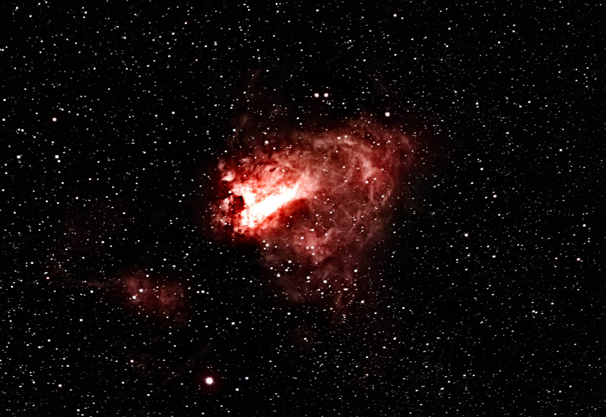
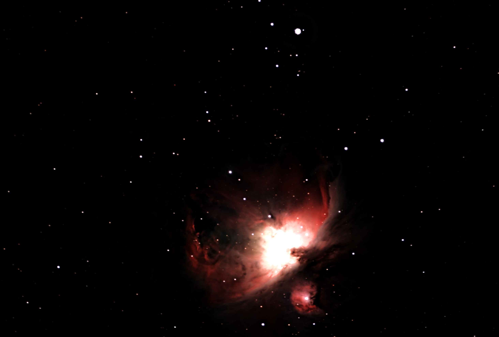
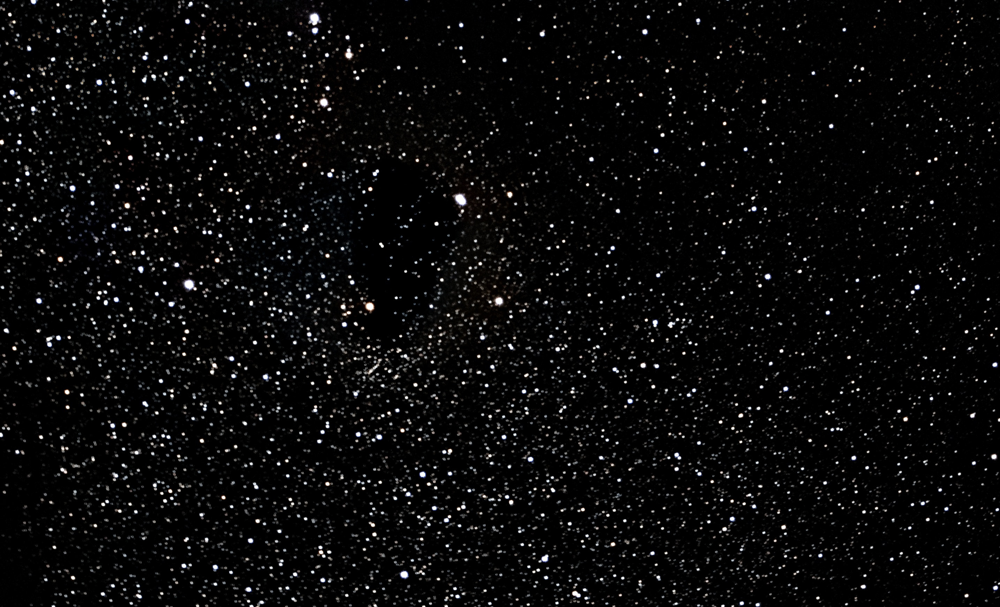

<p align="center">
  <picture>
    <source media="(prefers-color-scheme: dark)" srcset="assets/logo-dark.png">
    
  </picture>
</p>

**Streaming FITS stacker for astrophotography — runs on ordinary hardware, scales to any frame count.**

[](https://github.com/hd152/originstack/actions/workflows/ci.yml)
[](https://github.com/hd152/originstack/releases/latest)
[](LICENSE)

[**Website**](https://hd152.github.io/originstack/) · [Download](https://github.com/hd152/originstack/releases/latest) · [Changelog](CHANGELOG.md)

OriginStack is a full-featured Python pipeline for stacking and processing astronomical images, built from scratch: no OpenCV, scikit-image, PyWavelets, astroalign, astroquery or ONNX runtime — just NumPy, SciPy, Astropy and Pillow. The hot paths run in **Rust**: ~56 multi-threaded native kernels, ~5–150× faster than NumPy/SciPy, about 1.5–1.8× faster end to end on real sessions (see [Performance](#performance)), with a pure-NumPy fallback wherever the module isn't built. It was designed for the Celestron Origin smart telescope but works with any OSC/DSLR/mirrorless camera. Reads FITS, camera RAW (CR2/CR3/NEF/ARW/DNG/ORF/RW2/RAF/PEF/3FR/MRW/X3F/IIQ — needs `rawpy`), TIFF (needs `tifffile`), XISF, and SER (planetary/lucky-imaging video) — mix and match formats freely within one input directory. The core design principle is a **streaming architecture**: frames are loaded, processed, and freed one at a time, so memory usage stays constant regardless of how many frames you have.

---

## Sample Results

| Galaxy | Emission Nebula |
|:---:|:---:|
|  |  |
| *Whirlpool Galaxy (M51)* | *Omega Nebula (M17), 114 x 30 s* |

| Emission / Reflection Nebula | Star Cloud |
|:---:|:---:|
|  |  |
| *Orion Nebula (M42), seven sessions combined* | *Sagittarius Star Cloud (M24), 138 x 10 s* |

All stacked and processed entirely with OriginStack from raw Celestron Origin FITS frames (`--preset galaxy` for the Whirlpool, `--preset nebula` for the two nebulae, `--preset starfield` for the star cloud -- see [Usage Examples](#usage-examples)). The Orion Nebula is a hierarchical multi-session combine: each night is stacked separately, registered onto the deepest one, merged, and post-processed once.

**Sky conditions.** These are backyard/rooftop sessions under **Bortle 7-9** skies (heavy light pollution, urban/suburban), not a dark site -- measured per session with `estimate_bortle()` (`src/quality.py`, a rough same-equipment sky-glow bucket from calibrated background level vs. exposure/gain; not survey-grade photometry, see the function's docstring for what it isn't). None of the samples above -- or the two added for the [Andromeda Galaxy and Horsehead/Flame Nebula](https://hd152.github.io/originstack/#gallery) gallery entries on the website -- were shot from a dark site. The pipeline's background extraction, sky-floor correction and gradient removal are what make these usable at all under that much sky glow.

---

## Sample Output

<details>
<summary>Click to expand — verbose run on 300 Whirlpool Galaxy frames</summary>

```
======================================================================
Astrophotography FITS Stacker
======================================================================
Input:  lights/Whirlpool_Galaxy
Output: whirlpool.fits
  Compute: CPU

Discovering frames...
  Mode: Single folder
  Found 303 FITS files: 300 lights, 1 darks, 1 flats, 1 bias

Creating master calibration frames...
  [OK] Master bias:  1 frames -> 2048x3056
  [OK] Master dark:  1 frames -> 2048x3056
  [OK] Master flat:  1 frames -> 2048x3056
  [OK] Hot pixel map: 214576 pixels from dark frame
    Bias:  pedestal=4990.7 ADU  noise=0.8 ADU  -> Good (low read noise)
    Dark:  median=4917.1 ADU  temp=31.3°C  exp=30.0s  ISO=200  -> OK
    Flat:  R=0.765/G1=1.114/G2=1.122/B=0.922  vignetting=3.4%  -> Good

======================================================================
PHASE 1: PROCESSING & QUALITY ANALYSIS
======================================================================
  Processing 300 frames in parallel (8 workers)...

  Frame Quality Details:
  ---------------------------------------------------------------------------------------------------------------
  Frame                            Bright       Bg   Noise   SNR  Stars   FWHM    Sharp      Score  St
  ---------------------------------------------------------------------------------------------------------------
  Light0001.fits                   4558.1   4558.1  101.99   1.7     78    7.0   236280       56.4   [OK]
  Light0002.fits                   4531.2   4531.2  101.13   1.7     77    7.0   224233       56.4   [OK]
  Light0003.fits                   4499.2   4499.2  104.04   1.6     73    7.1   248395       53.5   [OK]
  Light0004.fits                   4491.5   4491.5  100.00   1.7     72    6.8   217981       58.1   [OK]
  Light0005.fits                   4458.1   4458.1  104.04   1.6     71    6.6   244558       57.8   [OK]
  ...
  ---------------------------------------------------------------------------------------------------------------
  [OK] Accepted: 287/300 (95.7%)
  [X] Rejected:  13 (quality threshold)

  Target: Whirlpool Galaxy [Galaxy]  conf=90%  source=header

======================================================================
PHASE 2: REGISTRATION
======================================================================
  Reference frame: Light0009.fits (score=60.9)
  Calculating shifts for 287 frames...
    Light0001.fits: affine shift=(-6.0, +5.1) px, rotation=+0.000 deg
    Light0002.fits: affine shift=(-2.6, +1.4) px, rotation=+0.000 deg
    Light0003.fits: affine shift=(-1.8, +1.1) px, rotation=-0.003 deg
    Light0004.fits: affine shift=(-0.4, +0.4) px, rotation=-0.003 deg
    Light0005.fits: affine shift=(+0.0, +0.0) px, rotation=+0.000 deg  [reference]
    ...
  Shift statistics:
    X: mean=+13.7px, std=16.1px, range=[-6.0, +33.9]
    Y: mean=-11.7px, std=13.8px, range=[-30.4, +5.1]
    Magnitude: mean=20.8px, max=43.3px
  Dither pattern detected — sigma_clip stacking recommended
  Tip: dithered data detected — add --drizzle-scale 2.0 for super-resolution

======================================================================
PHASE 3: STACKING
======================================================================
  Method: sigma_clip (sigma=3.0, iters=3, estimator=MAD)
  Quality weights: min=0.937, max=1.000, mean=0.972
  Tiled sigma-clip: 96 tiles of 256x256

======================================================================
PHASE 4: POST-PROCESSING
======================================================================
  Removing residual hot pixels (per-channel)...
  [OK] Per-channel hot pixel removal: 144 pixels fixed (5.9s)
    Post-processing star mask: 115 stars

  Applying Dynamic Background Extraction (patch=64px, RBF thin-plate-spline)...
  [OK] Dynamic Background Extraction (24.5s)

  Applying chroma noise reduction (sigma=2.0)...
  [OK] Chroma noise reduction (1.8s)

  Applying adaptive wavelet denoising (BayesShrink, chroma_factor=2.0)...
  [OK] Wavelet denoise (2.1s)

  Correcting sky residuals...
  [OK] Sky residual correction (35.1s)

  Applying star reduction (factor=0.40, blur_sigma=1.5)...
  [OK] Star reduction (0.9s)

  Applying multiscale local contrast enhancement (strength=0.70)...
  [OK] Local contrast enhancement (3.2s)

  Output size: 3036x2030 (cropped 20x18 pixels)

======================================================================
SUMMARY
======================================================================
  Frames analyzed:  300
  Frames stacked:   287 (95.7%)
  Integration time: 2h 23m
  Output:           whirlpool.fits (3036x2030x3)
  Preview:          whirlpool.jpg (ghs stretch)
  Avg FWHM:         6.73 px (best: 6.38)
  Avg SNR:          1.7  (best: 1.7)
  Processing time:  18m 42s
    Quality+Load:   4m 21s
    Registration:   3m 15s
    Stacking:       1m 44s
    Post-process:   9m 22s
  Peak memory:      1477.4 MB
======================================================================
```

</details>

---

## Features at a Glance

### Core Pipeline
- **Four-phase pipeline**: quality analysis → registration → stacking → post-processing
- **Streaming memory model**: ~0.4–1.2 GB for 50 × 4K frames (vs 10–20 GB with traditional approaches)
- **Automatic calibration**: bias, dark, and flat master frames built and applied automatically
- **Parallel processing**: multi-core via `ProcessPoolExecutor`; GPU acceleration via CuPy (`--use-gpu`)

### Input Formats
- **FITS** — always supported, no extra dependencies
- **Camera RAW** (CR2, CR3, NEF, ARW, DNG, ORF, RW2, RAF, PEF, 3FR, MRW, X3F, IIQ) — needs `pip install rawpy`; reads the undemosaiced sensor mosaic, so RAW lights go through the same debayer step as OSC FITS
- **TIFF** (16/32-bit) — needs `pip install tifffile`; common intermediate/export format from N.I.N.A., SharpCap, PixInsight, DeepSkyStacker
- **XISF** (PixInsight's native format) — no extra dependency; OriginStack can also write XISF (`--export xisf`)
- **SER** (FireCapture/SharpCap planetary/lucky-imaging video) — no extra dependency; each `.ser` file's frames are treated as individual lights
- Formats can be freely mixed within one input directory — calibration matching, quality filtering, and stacking don't care what format a frame came from

### Registration & Alignment
- Coarse-to-fine pyramid seed + sub-pixel FFT residual correlation (~0.05 px accuracy)
- **Affine registration** via star matching + RANSAC — corrects rotation, scale, and translation
- Automatic dither detection → selects sigma-clip stacking automatically
- Crops to the valid common region across all frames (no black borders)
- Sampled post-registration residual verification, escalating to all frames on failure; frames whose measured alignment error still exceeds threshold are dropped by default (`--no-reg-residual-reject` to keep them)
- The affine fit itself is sanity-checked (shift/rotation bounds) before use, falling back to translation-only registration on a bad RANSAC match instead of applying it uncorrected
- **Frames a rotating field breaks are rescued, not dropped**: on an alt-az mount the pyramid shift (translation only) returns garbage for a rotated frame; flagged frames are now registered by a blind rigid star match (a real session had 34 of 148 frames stacked at the wrong position before this)
- **The residual gate cannot reject a whole session**: if the absolute threshold would fail most frames, frames are judged against the session's own residual spread instead
- **Per-frame transparency** — the median flux of a fixed star ensemble relative to the session median, measured after registration; `--transparency-min 0.8` drops frames thinned by cloud/haze that the FWHM/SNR gates miss
- **Session-wide distortion model** (`--distortion-model`, off by default) — one radial distortion (two coefficients) fitted from every frame's star matches and applied as per-frame corrections in the same single resample pass; only applied if it clearly helps on frames the fit did not see
- **Elastic (non-rigid) local registration** (`--elastic-registration`, off by default) — fits a smooth per-frame local displacement field from matched-star residuals, correcting spatially-varying distortion (differential atmospheric refraction, field rotation, tube flexure) a single global affine can't. Composed into the same single resample pass as the affine warp (no extra blur pass), and works under `--drizzle-scale` too

### Stacking Methods (7)
| Method | Best For |
|--------|----------|
| `auto` *(default)* | Selects automatically based on frame count |
| `sigma_clip` | Most sessions (MAD-based iterative rejection) |
| `percentile` | Fewer than 8 frames |
| `esd` | Fewer than 15 frames (Grubbs/ESD statistical test) |
| `winsorized` | Like sigma_clip but clips to boundary |
| `median` | Robust, no tuning required |
| `mean` | Fastest, no rejection |

Drizzle super-resolution (`--drizzle-scale 2.0`) uses Lanczos-3 sub-pixel accumulation by default; `--drizzle-kernel {psf,magic}` swaps in a PSF-matched or ringing-free Magic-Kernel footprint, and `--super-res-iters N` adds iterative back-projection refinement. `--drizzle-method splat` uses true area-overlap drops instead of a Lanczos gather (~6x faster, softer, no ringing); the default resample path now accumulates in one native pass (1.4x, 3.9x with `--drizzle-pixfrac < 1`, same output).

### Quality Filtering
- Per-frame metrics: brightness, contrast, star count, FWHM, SNR, composite score
- Percentile-based rejection (default: keep best 75%, `--quality-threshold`)
- Hard rejection: blank, corrupt, or severely underexposed frames
- Quality-weighted stacking (SNR, FWHM, star count weighting)

### Post-Processing Chain
Applied in order after stacking. Steps marked ✅ are on by default; ❌ must be explicitly enabled:

1. ✅ Hot pixel removal on stacked image
2. ✅ Star mask generation (protects structure in subsequent steps)
3. ✅ Background extraction (DBE via Gaussian-weighted local-linear regression with Tukey-biweight IRLS, bounded by construction; or legacy mesh/wavelet)
4. ✅ Chroma noise reduction (fine pass; optional coarse pass for medium-scale colour blotches, auto-set for galaxy targets)
5. ✅ Sky floor normalisation (per-channel pedestal removal)
6. ✅ Sky residual correction (second pass after background extraction)
7. ✅ Sky pedestal — lift the background off zero before the non-negativity clips (prevents black-hole clipping)
8. ✅ Wavelet denoising — curvelet-inspired directional BayesShrink (`--denoiser wavelet`; `--wavelet-protect 0` turns the structure protection off; `--denoiser curvelet` is an alias)
9. ❌ Bilateral filter — `--denoiser bilateral`
10. ❌ ACDNR adaptive contrast denoising — `--denoiser acdnr`
11. ❌ Perona-Malik anisotropic diffusion — `--denoiser aniso` (native/Rust accelerated)
12. ❌ Subtractive Chromatic Noise Reduction — `--scnr`
13. ❌ Photometric colour calibration — `--photometric-calibration`
14. ❌ Deconvolution — `--deconvolve rl|tv|rl-sv|sparse` (RL is GPU-accelerated with `--use-gpu`; `rl-sv` is spatially-variant, `sparse` is FISTA in this project's wavelet basis)
15. ✅ Star reduction (softens star cores) — `--no-star-reduce` to disable
16. ✅ Multiscale local contrast enhancement (MLCE) — `--no-local-contrast` to disable
17. ✅ Edge-band correction (`--skip-step edge_bands`) — removes the sky excess that rises toward the frame edges, then the final sky flattening + neutralisation (masked large-scale per-channel background → neutral grey)

Opt-in variants of the chain: `--starless-process` runs the denoisers and local contrast (and deconvolution, if enabled) on a starless copy and adds the stars back untouched; `--layered-stretch` takes the preview's black/white points from a starless copy so a faint galaxy or nebula owns the tonal range instead of being squeezed under the stars' white point.

> The auto-advisor enforces a **single primary luma denoiser** (the curvelet
> wavelet, with ACDNR only as the fallback sky smoother) — layering several
> full-frame smoothers erodes faint structure without adding selectivity. Pick
> explicitly with `--denoiser`. NLM, BM3D and MMT were removed after a
> ground-truth benchmark (`tools/bench_denoise_quality.py`): NLM damaged star
> cores, MMT erased fine structure, BM3D was slow and licence-encumbered.

### Presets
Eight built-in target presets tune all parameters at once:

```bash
--preset galaxy       # GHS stretch, star reduction, bilateral filter
--preset nebula       # GHS stretch, curvelet + ACDNR denoising
--preset narrowband   # Tuned for Ha/OIII/SII narrow-band data
--preset starfield    # No star reduction, minimal processing
--preset planetary    # No background extraction, deconvolution enabled
--preset lunar        # Linear stretch, no star reduction
--preset quick        # Mean stack, minimal post-processing (fastest)
--preset quality      # All denoisers, sigma-clip, deconvolution (best output)
```

### Advanced Features
- **Plate solving** via ASTAP or nova.astrometry.net — writes WCS to FITS header, identifies objects via SIMBAD
- **Photometric colour calibration** — gray-locus method (`--photometric-calibration`), or full field-star calibration via Gaia DR3 (`--color-calibrate`)
- **Aperture photometry** (`--photometry`) — calibrates the stack against Gaia DR3: per-channel zero points (optional colour terms), airmass from the `info.json` GPS + time, a Poisson error term from raw bias/flat pairs, and a `<output>_photometry.csv` star catalogue with magnitudes + uncertainties
- **Differential light curves** (`--photometry-timeseries`) — aperture-photometers a fixed Gaia star list on every registered sub and ensemble-calibrates, writing per-frame + per-star CSVs with a variability flag; `--photometry-target "RA,DEC"` reports one star
- **Banding removal** (`--banding-removal`) — per-row/column offsets removed from each calibrated Bayer frame before debayering, per colour plane, only where significant; a clean frame is left essentially untouched
- **Session diagnostics report** (`--session-report`) — `<output>_session.png` + `.csv`: FWHM, transparency, SNR, background, drift, field rotation, ellipticity, residual and temperature against time, with the drift rate, any periodic tracking error, the rotation rate and any focus-vs-temperature drift printed
- **Noise validation** (`--noise-validate`) — stacks the odd and even frames separately; their difference is an empirical noise map (`<output>_noise.fits`) and their local correlation shows which structure is repeatable (`<output>_consistency.fits`)
- **Moving objects** (`--moving-objects`, `--moving-objects-stack`) — links per-frame residuals into asteroid-like tracks by voting in velocity space; optionally stacks a window along each track so a mover too faint for any one frame comes up out of the noise
- **Light-curve analysis** (`--lightcurve-analysis`, with `--photometry-timeseries`) — Lomb-Scargle period search with a false-alarm probability and a box-least-squares + trapezoid transit fit with errors and a BIC test
- **Bayer-aware drizzle** (`--cfa-drizzle`, opt-in) — recombines each frame's *measured* colour samples instead of debayer-interpolated ones (native kernel, 15.7× the numpy path). On well-sampled data it trades 13% lower luma noise for 2× colour noise and no sharpness gain, so it is meant for undersampled data
- **Comet nucleus tracking** — dual-registered stacks (`_comet.fits`)
- **HDR combining** — blends short/long exposure stacks for high-dynamic-range targets
- **Mosaic stitching** — WCS-based reprojection via `reproject` (`--mosaic`)
- **Incremental stacking** — fold previous nights' saved stacks into tonight's run in seconds (`--merge`); output chains into future merges. Stacks from different exposure/ISO are mapped onto one flux scale first and weighted by measured noise, not frame count
- **Multi-session (hierarchical) runs post-process the combined stack** — the combined output goes through Phase 4 with the reference session's settings, and the reference grid is the session with the most integration time
- **Desktop app** — a native window (`python desktop_app.py`, or the packaged `OriginStack.exe`) with phase progress, log stream, per-frame quality ticker, and an interactive preview (zoom/pan, before/after wipe compare) while stacking — see [Desktop App](#desktop-app) below
- **Collection quality sweep** — recursively score every light in a folder tree and rename poor frames to `*.fits.rejected` (`--quality-sweep`, dry-run by default, reversible with `--sweep-undo`)
- **Checkpointing** — save raw pre-post stack for iterative post-processing (`--keep-checkpoint`); coalesces with `--merge` for fast tuning of merged stacks
- **Diagnostic snapshots** — FITS snapshots before each post-processing step (`--debug diagnostic`)
- **Quality CSV** — per-frame metrics exported for external analysis (`--quality-report`)
- **Galaxy/extended-source exclusion masking** (`--galaxy-mode`, `--galaxy-center X,Y`) — protects a galaxy's broad halo from background extraction, so it isn't fit and subtracted as gradient; auto-enabled for galaxy targets by `--auto`
- **Robust-PCA master calibration** (`--master-method robust_pca`, `--flat-from-lights`) — separates true shared calibration pattern from session-specific outliers (dust motes, transient hot pixels) instead of a per-pixel median
- **Real-time and streaming stacking** — `--live` folds new subs into a running stack as they land; `--stream` two-pass streams an already-complete large directory at O(1) full-resolution memory
- **originvision classification** (`--originvision`) — a bundled defect/quality/category CNN that samples a few frames to feed target-type detection and flag defective frames defensively. Runs fully in-process (native Rust `tract` inference, or a Python `onnxruntime` fallback in a source checkout) — nothing external to install. `--originvision-score-all` scores every frame (slower, opt-in)
- **Object annotation** (`--annotate`) — labels bright stars and named deep-sky objects on a copy of the preview, using a WCS solution

---

## Installation

Requires Python 3.10+ (the optional native extension targets the CPython 3.10 ABI).

```bash
# 1. Clone the repo
git clone https://github.com/hd152/originstack.git
cd originstack

# 2. Create a virtual environment (recommended)
python -m venv .venv
source .venv/bin/activate       # Linux/macOS
.venv\Scripts\activate          # Windows

# 3. Install core dependencies
pip install -r requirements.txt

# 4. Optional: GPU support (requires CUDA toolkit)
pip install -r requirements-gpu.txt

# 5. Optional: plate solving
pip install -r requirements-astrometry.txt

# 6. Optional: native (Rust) acceleration for stacking + registration
#    Needs a Rust toolchain + maturin. See "Native (Rust) acceleration" below.
cd ext/astro_native && maturin develop --release   # into a venv
```

**Optional dependencies** — all gracefully degraded when absent:

| Package | Feature |
|---------|---------|
| `psutil` | Memory-adaptive worker/memmap sizing (guarded with a fixed fallback everywhere) |
| `cupy-cuda*` | GPU acceleration (registration warp, Richardson-Lucy deconvolution) |
| `rawpy` | Camera RAW input (CR2/CR3/NEF/ARW/DNG/…) |
| `tifffile` | TIFF input and `--export tiff` output |
| `onnxruntime` | `--originvision` inference fallback (only for a source checkout without `astro_native` built) |
| `reproject` | Mosaic stitching |
| `astro_native` (Rust) | ~44 native kernels: stacking combines (incl. Linear Fit Clipping, inverse-variance-weighted), Lanczos warp (alignment+drizzle), L.A.Cosmic, median filters, DBE, anisotropic diffusion, Malvar + Menon2007 debayer, bilateral filter, matched-filter star detection, rigid-transform RANSAC, 2D wavelet transform, blind star-pattern match, BM3D block-matching fallback, hot-pixel fix/replace, 1D + 2D Moffat/Gaussian PSF fits, and the full `--originvision` inference path (pure-Rust `tract` ONNX) |

`opencv-python`, `astroalign`, `scikit-image`, `PyWavelets`, and `astroquery` are not used anywhere in this codebase — Malvar/Menon2007 debayer and the bilateral filter are native Rust kernels (numpy fallback if `astro_native` isn't built); `--merge`'s cross-night registration (arbitrary field rotation between nights) is `src/blind_match.py`, also native; NLM denoising, Richardson-Lucy's CPU fallback, and satellite-trail detection are native/numpy now; the wavelet denoiser and multiscale-entropy seeing metric's transform are native (`src/wavelet.py`); every network catalogue lookup (astrometry.net, Gaia, VizieR, SIMBAD, JPL Horizons) is direct HTTP via `src/net_query.py` (stdlib urllib) — no dependency for any of them.

---

## Quick Start

### Single folder of lights

```bash
python originstack.py -d lights/ -o stacked.fits
```

OriginStack will automatically detect any calibration frames (`dark_*.fit`, `flat_*.fit`, `bias_*.fit`) in the same directory, build master frames, stack the lights, and write a FITS file and a preview JPEG.

### Verbose output with quality metrics

```bash
python originstack.py -d lights/ -o stacked.fits -v
```

Shows per-frame brightness, contrast, star count, SNR, and shift magnitude as each frame is processed.

### Auto target detection

```bash
python originstack.py -d lights/ -o stacked.fits --auto
```

Analyses your frames and applies optimised settings for the detected target type (galaxy, nebula, star field, etc.) — no manual tuning required.

### Hierarchical session (multiple targets in one night)

```bash
python originstack.py -d session/ -o combined.fits --debug intermediates -v
```

Where `session/` contains one subfolder per target. Each subfolder is stacked independently with its own calibration frames, then combined into a single output.

---

## Desktop App

A native window for anyone who'd rather not memorize CLI flags:

```bash
python desktop_app.py
```

On Windows, the packaged build needs no Python install at all: download `OriginStack-<version>-setup.exe` from the [latest release](https://github.com/hd152/originstack/releases/latest) and run it (per-user install, Start Menu entry, uninstaller). Prefer the zip? **Extract all of it** first and run `OriginStack.exe` from the extracted folder — running the exe from inside the zip preview fails with "Failed to load Python DLL". On Linux, download `OriginStack-<version>-linux-x64.tar.gz` (and its `.sha256`) from the same page, extract it and run `./install.sh` (per-user install, application-menu entry, `./install.sh --uninstall` to remove); it needs glibc 2.35 or newer and has had less real-world use than the Windows build. See [Packaging](packaging/README.md).

The window has two columns:
- **Left — Setup + Log** — the CLI flags as a form (grouped, auto-generated from the same argument parser the CLI uses, so it never drifts out of sync; directory/output fields get a native picker, hover any field for its full description). Diagnostics, fine-tuning and experimental options stay hidden until you tick **Expert options**. Below the form come the pipeline phase bar and the live log — the same output you'd see on the command line.
- **Right — Preview + frames** — the stacked result, updated live at each milestone: scroll to zoom, drag to pan, toggle **Compare** to wipe between two milestones (e.g. the linear pre-post-processing stack vs. the final result). Below it, a per-frame thumbnail strip and a running table of per-frame quality (score, SNR, star count, FWHM) as Phase 1 scores each light.

Closing the window while a run is in progress asks for confirmation first; a native OS notification fires when a run finishes, so you don't have to keep the window in view.

---

## Usage Examples

### Galaxy (e.g., M51, M81)

```bash
python originstack.py -d lights/ -o galaxy.fits \
  --preset galaxy \
  --debayer-method malvar \
  --stack-method sigma_clip \
  --rejection-sigma 2.8 \
  --deconvolve rl \
  -v
```

The `galaxy` preset applies GHS stretching and star reduction. Adding `--deconvolve rl` sharpens fine detail in spiral arms.

### Emission nebula (e.g., Orion, Rosette)

```bash
python originstack.py -d lights/ -o nebula.fits \
  --preset nebula \
  --denoiser mmt \
  --stretch ghs \
  -v
```

### Narrow-band (Ha/OIII/SII)

```bash
python originstack.py -d ha_lights/ -o ha_stack.fits \
  --preset narrowband \
  --white-balance none \
  --scnr \
  --stack-method sigma_clip --rejection-sigma 3.0 \
  -v
```

### Planetary / lunar

```bash
python originstack.py -d frames/ -o jupiter.fits \
  --preset planetary \
  --deconvolve rl \
  --no-background-extraction \
  --no-star-reduce \
  -v
```

### Star field / open cluster (e.g., Pleiades, double cluster)

```bash
python originstack.py -d lights/ -o starfield.fits \
  --preset starfield \
  --stack-method sigma_clip \
  -v
```

The `starfield` preset skips star reduction (the whole point of the target)
and keeps post-processing minimal so points stay sharp and colour-true.

### Globular cluster (e.g., M13, M4) / reflection nebula (e.g., M78)

```bash
python originstack.py -d lights/ -o cluster.fits \
  --preset starfield \
  --auto \
  -v
```

Neither has a dedicated preset — `starfield` (no star reduction) plus
`--auto` gets you the rest: the classifier detects `globular_cluster` or
`reflection_nebula` from the frame's star density/colour signature and
blends in matching denoise/stretch settings on top.

### Maximum quality

```bash
python originstack.py -d lights/ -o best.fits \
  --preset quality \
  --debayer-method malvar \
  --denoiser mmt \
  --deconvolve rl \
  --stack-method sigma_clip --rejection-sigma 2.5 \
  -v
```

### Incremental stacking — add tonight's frames to a saved stack

```bash
# First night: normal run; the output FITS is a mergeable linear stack
python originstack.py -d night1/ -o m51.fits --auto -v

# Later nights: process only the new frames, fold in the saved stack (seconds)
python originstack.py -d night2/ -o m51_v2.fits --auto --merge m51.fits -v
```

Each previous stack is registered onto the new session's grid (handles
cross-night field rotation via a blind rigid star-pattern match, no
assumption about the angle) and combined as a per-pixel `NFRAMES`-weighted
mean. The output chains into future merges.

### Super-resolution drizzle (requires dithered frames)

```bash
python originstack.py -d lights/ -o drizzled.fits \
  --drizzle-scale 2.0 \
  --drizzle-pixfrac 0.7 \
  -v
```

### Plate solving + colour calibration

```bash
# Set your API key first
export ASTROMETRY_API_KEY=your_key_here   # Linux/macOS
set ASTROMETRY_API_KEY=your_key_here      # Windows

python originstack.py -d lights/ -o stacked.fits \
  --plate-solve \
  --color-calibrate \
  -v
```

### Session diagnostics and the optional analyses

```bash
# How did the night go? Drift, rotation, focus trend, transparency
python originstack.py -d lights/ -o stacked.fits --session-report

# Drop frames thinned by cloud (relative flux < 0.8), remove sensor banding
python originstack.py -d lights/ -o stacked.fits --transparency-min 0.8 --banding-removal

# Look for asteroids and stack along the first tracks
python originstack.py -d lights/ -o stacked.fits --moving-objects-stack

# Measured noise + which structure is repeatable, session-wide distortion fit
python originstack.py -d lights/ -o stacked.fits --noise-validate --distortion-model

# Period/transit search on the light curves (needs a session WCS)
python originstack.py -d lights/ -o stacked.fits --photometry-timeseries --lightcurve-analysis
```

### Debug registration problems

```bash
python originstack.py -d lights/ -o stacked.fits --debug registration
```

Writes PNG overlay images and shift statistics to `_registration_debug/`. Use this when frames aren't aligning correctly.

### Clean up a collection — flag poor lights

```bash
# Dry run: walk the whole tree, score every light, report what would be flagged
python originstack.py --quality-sweep -d "G:\astro\Astrophotography"

# Apply: rename flagged frames to *.fits.rejected (invisible to stacking)
python originstack.py --quality-sweep -d "G:\astro\Astrophotography" --apply

# Change your mind: restore every flagged file
python originstack.py --sweep-undo -d "G:\astro\Astrophotography"
```

Uses the exact same quality gate as stacking: hard failures (no stars, SNR < 0.5,
near-zero contrast), statistical outliers vs each folder, and scores below
`--quality-threshold`%% of the folder's 90th-percentile reference.

### Health check without stacking

```bash
python originstack.py -d lights/ --health-check
```

Analyses calibration quality (bias noise, dark thermal current, flat vignetting) and reports any ISO or dimension mismatches — without actually stacking anything.

### Save a config file for reuse

```bash
# First run with --dry-run to see resolved parameters
python originstack.py -d lights/ -o stacked.fits --preset galaxy --deconvolve --dry-run

# Then use --config to reapply the same settings
python originstack.py -d lights/ -o stacked.fits --config my_settings.toml
```

---

## Folder Organization Modes

OriginStack supports four ways of organizing your input files. The first two are auto-detected; the last two require an explicit flag.

---

### Mode 1 — Single folder

Put all your FITS files (lights and optional calibration frames) in one directory and point `-d` at it.

```
lights/
├── bias_001.fit          (optional)
├── dark_001.fit          (optional)
├── flat_001.fit          (optional)
├── light_001.fit
├── light_002.fit
└── ...
```

```bash
python originstack.py -d lights/ -o stacked.fits
```

OriginStack builds master calibration frames from any bias/dark/flat files it finds, then processes and stacks all light frames into a single output FITS.

---

### Mode 2 — Hierarchical (multiple targets, auto-detected)

Use this when you have captured several different targets in one night and want them each stacked separately. Create one subfolder per target. OriginStack detects subfolders automatically — no flag required.

```
session/
├── M31/
│   ├── dark_001.fit
│   ├── flat_001.fit
│   ├── info.json          (optional — Celestron Origin metadata)
│   └── light_001.fit ... light_NNN.fit
├── M42/
│   ├── dark_001.fit
│   ├── info.json
│   └── light_001.fit ... light_NNN.fit
└── NGC7000/
    └── light_001.fit ... light_NNN.fit   (no calibration — OK)
```

```bash
python originstack.py -d session/ -o combined.fits -v
```

Each subfolder is stacked independently (its own calibration frames, quality analysis, and registration pass), then the per-target stacks are combined into the output FITS. Use `--debug intermediates` to also save the individual per-target stacks alongside the combined output.

**`info.json` support:** If a subfolder contains an `info.json` from the Celestron Origin app, OriginStack reads the target name, Bayer pattern, and WCS (RA/Dec/FOV/orientation) from it automatically. Each subfolder's `info.json` is loaded independently, so different subfolders can cover different sky coordinates.

---

### Mode 3 — Combine sessions (`--combine-sessions`)

Use this when you have captured the **same target across multiple nights** and want a single unified deep stack. Every light frame from every subfolder is pooled into one registration and stacking pass.

```
m51_sessions/
├── 2024-04-01/
│   ├── info.json
│   └── light_001.fit ... light_NNN.fit
├── 2024-04-03/
│   ├── info.json
│   └── light_001.fit ... light_NNN.fit
└── 2024-04-07/
    ├── dark_001.fit      (shared calibration)
    ├── flat_001.fit
    ├── info.json
    └── light_001.fit ... light_NNN.fit
```

```bash
python originstack.py -d m51_sessions/ -o m51_deep.fits --combine-sessions -v
```

All calibration frames across all subfolders are merged into shared masters, then every light frame is quality-analysed, registered, and stacked together as if they came from a single session. This is the best approach for maximising integration time on a single target.

**When to use vs. hierarchical mode:**

| | Hierarchical (default) | Combine sessions |
|---|---|---|
| Multiple targets in `-d` | ✅ each stacked separately | ❌ only one target |
| Same target, multiple nights | produces separate stacks | ✅ one deep unified stack |
| Per-target calibration | ✅ each subfolder independent | merged into shared masters |
| Memory usage | bounded per target | all frames pooled; larger |

**Bayer pattern check:** If `info.json` files across subfolders report different Bayer patterns (e.g., mixing cameras), OriginStack will print a warning before stacking proceeds. Per-frame FITS headers always take priority over `info.json` defaults.

---

### Mode 4 — Mosaic (`--mosaic`)

Use this when your subfolders are **adjacent sky panels** of the same large target, and you want them stitched into a single wide-field image using WCS reprojection.

```
panels/
├── panel_1/
│   ├── info.json          (provides WCS — or use --plate-solve)
│   └── light_001.fit ... light_NNN.fit
├── panel_2/
│   ├── info.json
│   └── light_001.fit ... light_NNN.fit
└── panel_3/
    ├── info.json
    └── light_001.fit ... light_NNN.fit
```

```bash
python originstack.py -d panels/ -o mosaic.fits --mosaic -v
```

Each subfolder is first stacked independently (phases 1–4), then all panel stacks are reprojected onto a common optimal WCS grid and blended with distance-weighted feathering to eliminate seams. Overlap zones are background-matched automatically.

**Requirements:**
- `pip install reproject` — WCS-based reprojection library
- Every panel must have a valid WCS: either from `info.json` (Celestron Origin) or from plate solving (`--plate-solve`)
- If any panel is missing a WCS, the mosaic step is skipped with a warning

---

### Auto-detection summary

| What's in `-d` | Mode selected |
|---|---|
| FITS files directly in the directory | **Single folder** (auto) |
| Subdirectories containing FITS files | **Hierarchical** (auto) |
| Subdirectories + `--combine-sessions` flag | **Combine sessions** |
| Subdirectories + `--mosaic` flag | **Mosaic** |

---

## Post-Processing Default Flags

Most post-processing is **on by default**. Here are the disable flags:

| Feature | Default | Disable with |
|---------|---------|-------------|
| Background extraction (DBE) | ✅ on | `--no-background-extraction` |
| Luma denoising (wavelet) | ✅ on | `--denoiser none` |
| Chroma noise reduction | ✅ on | `--no-chroma-nr` |
| Star reduction | ✅ on | `--no-star-reduce` |
| Star removal (writes a `_starless.fits` sidecar; main output keeps stars) | ❌ off | `--remove-stars` |
| Local contrast enhancement | ✅ on | `--no-local-contrast` |
| Chromatic aberration correction | ✅ on | `--no-ca-correction` |
| Cosmic ray rejection | auto | `--cosmic-ray-rejection` / `--no-cosmic-ray-rejection` (auto-skipped on deep rejection stacks) |
| Quality filtering | ✅ on | `--no-quality-filter` |
| Affine registration | ✅ on | `--no-affine` |
| Elastic local registration | ⬜ off | `--elastic-registration` |
| Primary denoiser choice | auto (curvelet) | `--denoiser {curvelet,wavelet,acdnr,bilateral,aniso,none}` |
| Deconvolution | ❌ off | `--deconvolve {rl,rl-sv,tv,sparse}` |

---

## CLI Reference (Abridged)

```
python originstack.py -d <dir> -o <output.fits> [options]
```

| Flag | Description |
|------|-------------|
| `-d, --directory` | Input directory (required) |
| `-o, --output` | Output FITS path (required unless `--health-check` or `--dry-run`) |
| `--preset NAME` | Apply named preset (quick, quality, galaxy, nebula, narrowband, starfield, planetary, lunar) |
| `--config PATH` | Load parameters from TOML file |
| `--no-auto` | Disable the heuristic target classifier (on by default; detects target type and optimises settings automatically) |
| `--stack-method METHOD` | Stacking algorithm (auto, mean, median, sigma_clip, percentile, esd, winsorized, linear_fit, ivw, wavelet) |
| `--debayer-method METHOD` | Debayer algorithm (malvar (default), menon2007) |
| `--white-balance METHOD` | White balance (grayworld, whitepatch, none) |
| `--bg-method METHOD` | Background extraction (dbe, mesh, wavelet) |
| `--drizzle-scale N` | Super-resolution scale (1.0 = off, 2.0 = 2×) |
| `--elastic-registration` | Local (non-rigid) displacement correction on top of the global affine (off by default) |
| `--distortion-model` | One radial distortion for the whole session, applied per frame (off by default; skipped with `--elastic-registration`) |
| `--transparency-min 0-1` | Drop frames whose relative transparency is below this (0 = report only) |
| `--banding-removal` | Remove row/column banding from each calibrated frame (off by default) |
| `--cfa-drizzle` | Bayer-aware drizzle of the measured samples (opt-in; for undersampled data) |
| `--noise-validate` | Odd/even half-stacks: measured noise map + repeatable-structure map |
| `--moving-objects[-stack]` | Find asteroid-like movers; optionally stack along each track |
| `--session-report` | Write `<output>_session.png` / `.csv` diagnostics |
| `--lightcurve-analysis` | Period + transit analysis of `--photometry-timeseries` light curves |
| `--denoiser NAME` | Primary luma denoiser (auto — wavelet unless overridden —, wavelet, acdnr, bilateral, aniso, none; `curvelet` is an alias for `wavelet`) |
| `--wavelet-protect 0-1` | Structure protection for the wavelet denoiser (default 0.6; 0 = plain BayesShrink) |
| `--starless-process` | Denoise / local-contrast / deconvolve a starless copy, add the stars back untouched |
| `--layered-stretch` | Preview stretch points taken from a starless copy (preview JPEG only) |
| `--deconvolve {off,rl,rl-sv,tv,sparse}` | Richardson-Lucy (global or spatially-variant), TV, or sparse-wavelet deconvolution |
| `--plate-solve` | Plate solve via astrometry.net (requires API key) |
| `--comet-mode` | Dual-register for comet nucleus tracking |
| `--hdr-combine PATH` | Blend short-exposure stack for HDR |
| `--mosaic` | Stitch per-subfolder stacks via WCS reprojection |
| `--merge STACK.fits [...]` | Incremental stacking: fold previous linear stacks into this run |
| `--quality-sweep [--apply]` | Recursively flag poor lights across a collection (dry-run by default) |
| `--keep-checkpoint` | Save raw pre-post-processing stack for re-processing |
| `--quality-report PATH` | Write per-frame quality metrics to CSV |
| `--dry-run` | Discover frames, show parameters, estimate resources — no processing |
| `--health-check` | Analyse calibration and frames without stacking |
| `--debug KIND[,..]` | Debug artefacts: registration, diagnostic, intermediates, masks |
| `--use-gpu` | Enable CuPy GPU acceleration |
| `-j N, --parallel N` | Worker count (0 = auto-detect) |
| `-v, --verbose` | Detailed per-frame output |

For the full CLI reference with all flags and defaults, see [PROJECT_SPEC.md](PROJECT_SPEC.md).

---

## Performance

Measured end to end on real Celestron Origin data (2048×3056 frames, Windows 11, an 8-core / 16-thread CPU with 16 workers), comparing this release against the development build just before its optimisation work (same data, same config, same machine, run back to back):

| Session | Before | Now |
|---------|--------|-----|
| Fireworks Galaxy, 148 × 10 s frames, single session | 3 min 50 s | 2 min 27 s – 2 min 40 s (**~1.5×**) |
| Orion Nebula, 7 sessions (456 frames) combined hierarchically | 15 min 12 s | 8 min 16 s (**~1.8×**) |

Where the time went on the Fireworks run:

| Phase | Before | Now |
|-------|--------|-----|
| Phase 1 — load, calibrate, debayer, quality | 98 s | 51–52 s |
| Phase 2 — registration | 41 s | 31–40 s |
| Phase 3 — align + stack | 51 s | 26–33 s |
| ↳ per-frame alignment (141 frames) | 30 s | 12–15 s |

Drizzle (2×, 29 frames of the same session, Lanczos-3 kernel, just the accumulation loop):

| Mode | Before | Now |
|------|--------|-----|
| Resample, `--drizzle-pixfrac 1.0` | 12 s | 11 s |
| Resample, `--drizzle-pixfrac 0.7` | 49 s | 12 s (**~4×**) |
| `--drizzle-method splat` (area-overlap drops, opt-in) | — | 2 s (**~6×** the resample loop) |

Notes on reading these numbers:

- The multi-session (hierarchical) win is mostly structural: Phase 4 used to run on every session's stack and then again on the combined one; it now runs once, on the combined stack.
- Phase 4 on a 2× drizzle output (a 3780×5952 image) still takes roughly 10 minutes and dominates a drizzle run; it was not sped up.
- Registration timing varies from run to run (31 s and 40 s on identical code), so treat it as unchanged.
- The final stacks are not bit-for-bit reproducible between two runs of the same code (registration is not deterministic), so speed comparisons were made on timings, with each optimisation separately checked against the code it replaced.
- Two later changes are not in the table above: debayer's G1/G2 gain and 2×2 green offsets are now measured once per session instead of on every frame (`--no-session-cfa-eq` restores the per-frame path), taking Debayer from ~1.26 s to ~0.45 s per frame under 16 workers; and the temporary frame memmaps are no longer flushed to disk just before being deleted. Together they cut a 158-frame run from 135 s to 126 s with a bit-identical stack.
- Memory stays bounded by the streaming architecture — frames are loaded one at a time and freed after accumulation (about one or two frames resident, plus the aligned-stack memmap on disk), so 500+ frame sessions run in the same working set.

### Compared with Siril and DeepSkyStacker

Same lights, same bias/dark/flat, one machine (Windows 11, 8-core / 16-thread CPU, 64 GB RAM), each tool at default-style settings. Three Celestron Origin sessions: Omega Nebula (114 × 30 s), Sunflower Galaxy (158 × 20 s) and Sculptor Galaxy (532 × 10 s). Reproduce on your own data with [`tools/bench_vs_siril.py`](tools/bench_vs_siril.py).

OriginStack first, Siril second. "Stack only" leaves out OriginStack's finishing steps (background extraction, denoising, stretch), which Siril's script does not have:

| Session | Stack only | OriginStack, finished image | Peak memory | Star width |
|---------|-----------|-----------------------------|-------------|------------|
| Omega, 114 frames | 57 s / 72 s | 110 s | 16.5 / 8.1 GB | 4.40 / 4.56 px |
| Sunflower, 158 frames | 106 s / 81 s | 159 s | 16.9 / 8.7 GB | 3.56 / 3.60 px |
| Sculptor, 532 frames | 258 s / 150 s | 270 s | 16.7 / 11.2 GB | 2.78 / 2.95 px |

- **Sharpness: OriginStack is as sharp or sharper.** Its stars are 3% narrower than Siril's on Omega, level on Sunflower and 6% narrower on Sculptor. It used every frame (114/114, 158/158 and 532/532); Siril used 111, 157 and 525.
- **Speed depends on the session.** OriginStack stacks Omega faster and the two larger sessions slower (1.3× as long on Sunflower, 1.7× on Sculptor). Timings move by up to 15% between runs of the same code: Siril's Omega ranged from 53 to 72 s across our runs, OriginStack's Sunflower from 83 to 106 s.
- **Noise: Siril is still cleaner.** OriginStack's per-pixel noise (after matching the flux scale per channel) is 0.99–1.19× Siril's on Omega, 1.09–1.20× on Sunflower and 1.05–1.33× on Sculptor: about level in green, up to a third higher in red and blue. Part of that is the demosaicing filter: after calibration and debayering, a single OriginStack frame is about 9–10% noisier than Siril's in green and blue and about 11% quieter in red (Malvar-He-Cutler against Siril's RCD). The rest is not yet explained.
- **OriginStack's memory does not grow with the session.** It stayed at 16.5–16.9 GB from 114 to 532 frames, set by the worker count (`-j` lowers it), while Siril's grew from 8.1 to 11.2 GB. Siril uses less at these sizes. Peak temporary disk was about the same for both (18–59 GB).
- **DeepSkyStacker** took 14 min 8 s on Omega (defaults: plain average, no rejection), gave stars softer than both others (4.83 px against 4.56 for Siril on the same stars), and its stack showed horizontal hot-pixel streaks and a few misregistered frames. A tuned run would look better.
- **Where OriginStack fits.** It finishes the image in the same run with no setup, explains the night ([diagnostics](docs/advanced.html)), runs fully offline on request (`--offline`) and does much that the other tools leave to you. On a plain stack it is now competitive on sharpness and behind Siril on noise and, for larger sessions, on time.

How star width is measured matters more than it looks. It is a Gaussian fit to each of up to 400 bright, unsaturated, isolated stars, **at the same positions in both stacks and on each stack's own pixel grid** (no resampling), and the median is reported. An earlier version of this section compared each stack's FWHM over its own detected star list and concluded OriginStack's stars were tighter; that came from which stars were picked and was withdrawn. Measured properly, OriginStack's stars were then genuinely 13% wider than Siril's on Omega, until a hot-pixel filter that was clipping the cores of bright stars was found, by switching Phase 1 steps off one at a time, and fixed (see the changelog). Registration accuracy (about 0.1 px between frames), the warp kernel, rejection, weighting and normalisation were all checked and are not the cause of anything above.

Things these numbers do not show: three sessions from one camera are a small sample; Siril and DeepSkyStacker have many settings that were left alone; and DeepSkyStacker was not re-run after the fix.

### Native (Rust) acceleration

[`ext/astro_native/`](ext/astro_native/) is an optional PyO3/maturin crate of ~56 hot-path kernels, each with a numpy fallback (absent module → pure-Python path). It covers the Phase-1 calibration/cosmic-ray/debayer hot paths, the Phase-2/3 warp + combine hot path, drizzle, background extraction, star detection, RANSAC, several denoisers, the photometry aperture loop, PSF profile fitting, and the full `--originvision` inference path (preprocessing + ONNX forward pass via the pure-Rust `tract` runtime — no Python ONNX dependency). A representative sample:

| Kernel | Speedup vs numpy/scipy |
|--------|------------------------|
| `sigma_clip_combine` (default stack method) | ~37× |
| `esd_combine` / `percentile_clip_combine` / `median_combine` | ~24× / ~13× / ~6× |
| Fused patch-weighted + sigma-clip combine | ~100× |
| Per-frame Lanczos-3 warp (alignment + drizzle resample) | ~5× / ~26× |
| Malvar debayer (default Phase-1 debayer) | ~2× |
| Phase 1 calibration (bias/dark/flat/finite check/clip, one pass) | ~4× single-thread (40 → 9 ms) |
| Bayer hot-pixel repair / hot-pixel map replacement | ~25× / ~55× single-thread (715 → 29 ms / 666 → 12 ms) |
| RGB hot-pixel repair (luma + median + MAD + replace, fused) | ~22× single-thread (1174 → 52 ms) |
| Per-frame pre-gradient removal | ~40× (349 → 8 ms) |
| Debayer stage as a whole (medians, G1/G2 + grid equalisation in place) | ~2.2× under 16 workers (2207 → 1002 ms/frame) |
| L.A.Cosmic cosmic-ray rejection | ~2× under real parallel load |
| Median filter (3×3 network / larger windows) | ~13× / ~26×; the 3×3 picks an AVX2 version at run time (a further ~1.7×) |
| DBE surface fit + patch sampler | ~2.4× / ~31× |
| Anisotropic diffusion | ~37× |
| Batch aperture photometry (`--photometry` / `--photometry-timeseries`) | ~150× |
| CFA drizzle frame splat (`--cfa-drizzle`) | ~15.7× (407 s → 26 s, 148 frames) |
| White balance (default Phase 1 step, bit-identical to numpy) | ~6.9× single-thread |
| Lanczos-3 warp of a rotated frame (alignment, drizzle) | ~5× vs the previous kernel (2187 → ~415 ms/frame), and Phase 3 now warps only the common crop |
| Fused drizzle accumulate / area-overlap splat | ~1.4× (3.9× with pixfrac < 1) / ~6× |

Most Phase 1 kernels are bit-identical to the numpy code they replace; the rotated Lanczos warp takes its weights from an interpolated table (99.985% of output values identical, the rest one ulp off — `ORIGINSTACK_LANCZOS_EXACT=1` restores the closed form). Speedups were measured single-threaded unless noted; under a full worker pool memory bandwidth, not arithmetic, is the limit, which is why the whole-stage figures are smaller than the single-kernel ones.

See CLAUDE.md's "Native (Rust) acceleration" section for the full kernel-by-kernel list.

Build (needs a Rust toolchain + `pip install maturin`):

```bash
# into a virtualenv:
cd ext/astro_native && maturin develop --release
# system Python (no venv): build a wheel and install it
cd ext/astro_native && python -m maturin build --release
pip install --force-reinstall target/wheels/astro_native-*.whl
```

At runtime the startup banner reports `Native accel: astro_native vX ACTIVE …`, and each accelerated step logs a `[rust] …` line. The aligned stack is a float32 memmap that Rust views zero-copy, so the streaming memory model is preserved. GPU (`--use-gpu`) additionally accelerates the registration warp and Richardson-Lucy deconvolution via cupy.

### Iterating on the same data

Re-running the *same* `-o` output with `--keep-checkpoint` makes subsequent runs **skip Phases 1–3 entirely** (load the saved raw stack, redo only post-processing) — the fastest way to tune stretch/denoise settings.

---

## Architecture Overview

```
originstack.py                  ← thin backward-compatibility entry point
└── src/
    ├── cli.py                  ← argument parsing, process_directory(), main()
    ├── pipeline.py             ← four-phase orchestrator (stack_target)
    ├── frame_processor.py      ← Phase 1: parallel per-frame load/calibrate/quality
    ├── registration.py         ← Phase 2: shift calculation, affine/RANSAC
    ├── stacking.py             ← Phase 3: alignment, cropping, combine
    ├── postprocess.py          ← Phase 4: up to 20-step post-processing chain
    ├── debayer.py              ← Bayer demosaicing, hot pixels, white balance
    ├── quality.py              ← star detection, FWHM, quality metrics
    ├── background.py           ← DBE, mesh sky extraction, floor normalisation
    ├── denoising.py            ← curvelet wavelet, bilateral, ACDNR, aniso, stretch
    ├── psf_deconvolution.py    ← PSF estimation, Richardson-Lucy
    ├── io_fits.py              ← FITS load/save, master frame creation
    ├── frame_discovery.py      ← automatic frame classification
    ├── auto_settings.py        ← heuristic target classifier (--auto)
    ├── plate_solve.py          ← astrometry.net + SIMBAD
    ├── gpu_context.py          ← CPU/GPU abstraction (numpy ↔ cupy)
    ├── models.py               ← Config, FrameInfo, ProcessingStats
    ├── health_check.py         ← calibration analysis
    └── utils.py                ← print helpers, formatting
```

See [PROJECT_SPEC.md](PROJECT_SPEC.md) for a detailed architecture and feature reference.

---

## Testing

```bash
pip install pytest
pytest -q

# Run a specific test
pytest tests/test_core.py::test_calculate_shift_recovery -v

# CI smoke test (generates synthetic data, then stacks it)
python tools/create_synthetic.py
python originstack.py -d synthetic_data -o ci_synthetic_stack.fits \
  --debayer-method malvar --white-balance grayworld --stack-method median
```

---

## Diagnostics & Troubleshooting

**Frames not aligning?** Use `--debug registration`:
```bash
python originstack.py -d lights/ -o out.fits --debug registration
# Diagnostics written to _registration_debug/
```

**Want shift and quality data per frame?** Run with `-v`:
```bash
python originstack.py -d lights/ -o out.fits -v 2>&1 | tee run.log
```

**Not sure what's happening?** Run with `--dry-run` first:
```bash
python originstack.py -d lights/ -o out.fits --dry-run
```

See [QUICK_REFERENCE.md](QUICK_REFERENCE.md) for guidance on interpreting shift patterns and quality metrics.

---

## Network use and `--offline`

OriginStack works entirely on your machine. It goes online in these cases only, and never uploads your frames except to astrometry.net when you ask for plate solving:

| What | When | What is sent |
|------|------|--------------|
| SIMBAD lookup of the target | On a normal run, when the object name (from the session file, the FITS `OBJECT` header, or the folder name) is not in the built-in table | The name string only |
| astrometry.net | `--plate-solve` | The image, to solve its position (needs your API key) |
| Gaia / VizieR / SIMBAD catalogues | `--photometry`, `--photometry-timeseries`, `--annotate`, catalogue colour calibration | Sky coordinates of the field |
| JPL Horizons | Comet ephemerides | The comet designation and time |

Pass **`--offline`** (a checkbox in the desktop app's Core options) to make no network requests at all: the target lookup is skipped, and the features in the table that need the network are turned off with a note in the log. Everything else, including the default colour calibration, is computed locally. This is enforced where the requests are made rather than caller by caller, and a test counts real connection attempts.

---

## Plate Solving

Requires a free API key from [nova.astrometry.net](https://nova.astrometry.net/api_help) — no extra package (direct HTTP via `src/net_query.py`).

```bash
export ASTROMETRY_API_KEY=your_key_here

python originstack.py -d lights/ -o stacked.fits --plate-solve --color-calibrate
```

When plate solving succeeds, WCS keywords (CRVAL, CRPIX, CD matrix) are written to the FITS header and the field's primary object is identified via the SIMBAD database. The output FITS will then display coordinate grids in DS9, AstroImageJ, PixInsight, and similar tools.

Alternatively, use the ASTAP solver:
```bash
python originstack.py -d lights/ -o stacked.fits --plate-solve --plate-solver astap
```

## GPU Acceleration

This project supports GPU acceleration using CuPy. To enable GPU acceleration:

1. Install CuPy:
   ```bash
   pip install cupy-cuda11x  # Replace `11x` with your CUDA version
   ```
2. Ensure your system has a compatible NVIDIA GPU and CUDA drivers installed.

### Example Workflow with GPU Acceleration
```bash
python originstack.py -d lights/ -o stacked.fits --use-gpu
```

### Notes
- GPU acceleration is experimental and may not cover all code paths.
- Fallback to CPU occurs automatically if GPU is unavailable.

## License

MIT — see [LICENSE](LICENSE). Third-party dependency licenses are listed in
[THIRD_PARTY_NOTICES.md](THIRD_PARTY_NOTICES.md).
