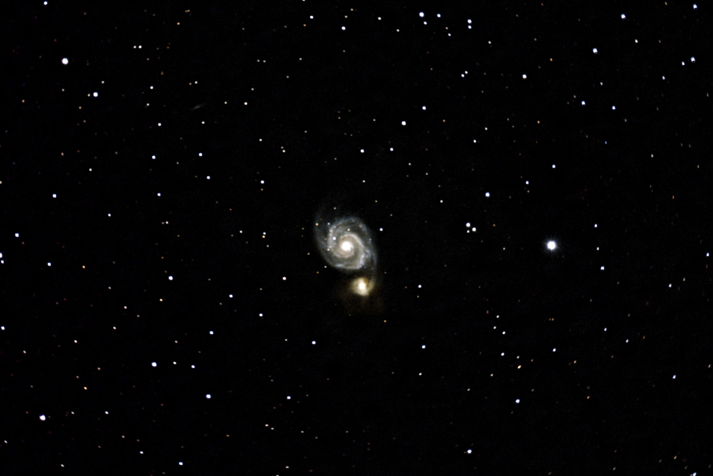
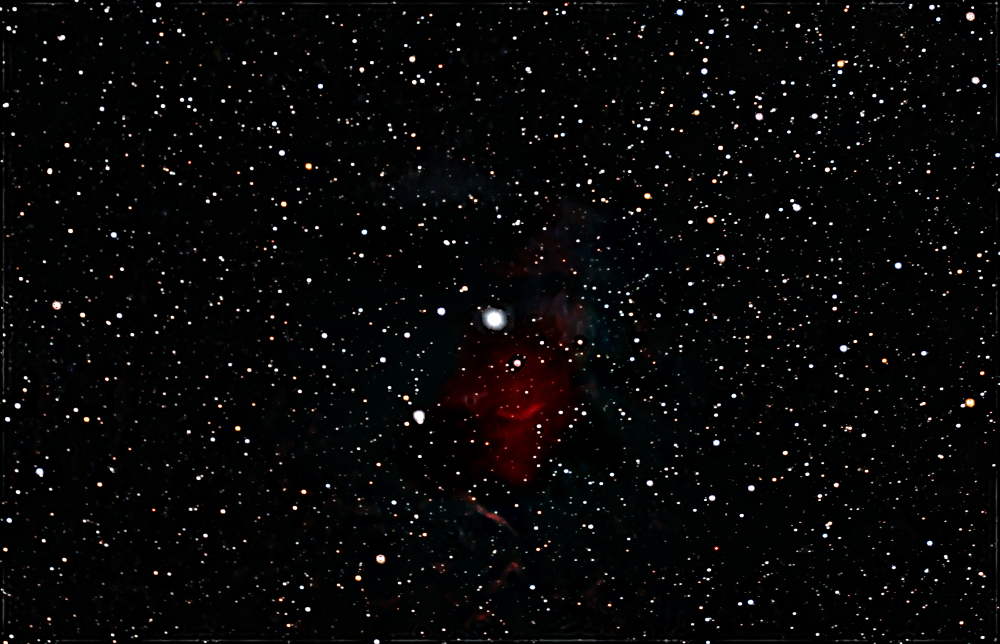

# OriginStack

**Streaming FITS stacker for astrophotography — runs on ordinary hardware, scales to any frame count.**

OriginStack is a full-featured Python pipeline for stacking and processing astronomical images. It was designed for the Celestron Origin smart telescope but works with any OSC/DSLR/mirrorless camera. Reads FITS, camera RAW (CR2/CR3/NEF/ARW/DNG/ORF/RW2/RAF/PEF/3FR/MRW/X3F/IIQ — needs `rawpy`), TIFF (needs `tifffile`), XISF, and SER (planetary/lucky-imaging video) — mix and match formats freely within one input directory. The core design principle is a **streaming architecture**: frames are loaded, processed, and freed one at a time, so memory usage stays constant regardless of how many frames you have.

---

## Sample Results

| Galaxy | Emission Nebula |
|:---:|:---:|
|  |  |
| *Whirlpool Galaxy (M51)* | *Flaming Star Nebula (IC 405)* |

Both stacked and processed entirely with OriginStack from raw Celestron Origin FITS frames (`--preset galaxy` and `--preset nebula` respectively — see [Usage Examples](#usage-examples)).

---

## Sample Output

<details>
<summary>Click to expand — verbose run on 300 Whirlpool Galaxy frames</summary>

```
======================================================================
Astrophotography FITS Stacker
======================================================================
Input:  lights/Whirlpool_Galaxy
Output: whirlpool.fits
  Compute: CPU

Discovering frames...
  Mode: Single folder
  Found 303 FITS files: 300 lights, 1 darks, 1 flats, 1 bias

Creating master calibration frames...
  [OK] Master bias:  1 frames -> 2048x3056
  [OK] Master dark:  1 frames -> 2048x3056
  [OK] Master flat:  1 frames -> 2048x3056
  [OK] Hot pixel map: 214576 pixels from dark frame
    Bias:  pedestal=4990.7 ADU  noise=0.8 ADU  -> Good (low read noise)
    Dark:  median=4917.1 ADU  temp=31.3°C  exp=30.0s  ISO=200  -> OK
    Flat:  R=0.765/G1=1.114/G2=1.122/B=0.922  vignetting=3.4%  -> Good

======================================================================
PHASE 1: PROCESSING & QUALITY ANALYSIS
======================================================================
  Processing 300 frames in parallel (8 workers)...

  Frame Quality Details:
  ---------------------------------------------------------------------------------------------------------------
  Frame                            Bright       Bg   Noise   SNR  Stars   FWHM    Sharp      Score  St
  ---------------------------------------------------------------------------------------------------------------
  Light0001.fits                   4558.1   4558.1  101.99   1.7     78    7.0   236280       56.4   [OK]
  Light0002.fits                   4531.2   4531.2  101.13   1.7     77    7.0   224233       56.4   [OK]
  Light0003.fits                   4499.2   4499.2  104.04   1.6     73    7.1   248395       53.5   [OK]
  Light0004.fits                   4491.5   4491.5  100.00   1.7     72    6.8   217981       58.1   [OK]
  Light0005.fits                   4458.1   4458.1  104.04   1.6     71    6.6   244558       57.8   [OK]
  ...
  ---------------------------------------------------------------------------------------------------------------
  [OK] Accepted: 287/300 (95.7%)
  [X] Rejected:  13 (quality threshold)

  Target: Whirlpool Galaxy [Galaxy]  conf=90%  source=header

======================================================================
PHASE 2: REGISTRATION
======================================================================
  Reference frame: Light0009.fits (score=60.9)
  Calculating shifts for 287 frames...
    Light0001.fits: affine shift=(-6.0, +5.1) px, rotation=+0.000 deg
    Light0002.fits: affine shift=(-2.6, +1.4) px, rotation=+0.000 deg
    Light0003.fits: affine shift=(-1.8, +1.1) px, rotation=-0.003 deg
    Light0004.fits: affine shift=(-0.4, +0.4) px, rotation=-0.003 deg
    Light0005.fits: affine shift=(+0.0, +0.0) px, rotation=+0.000 deg  [reference]
    ...
  Shift statistics:
    X: mean=+13.7px, std=16.1px, range=[-6.0, +33.9]
    Y: mean=-11.7px, std=13.8px, range=[-30.4, +5.1]
    Magnitude: mean=20.8px, max=43.3px
  Dither pattern detected — sigma_clip stacking recommended
  Tip: dithered data detected — add --drizzle-scale 2.0 for super-resolution

======================================================================
PHASE 3: STACKING
======================================================================
  Method: sigma_clip (sigma=3.0, iters=3, estimator=MAD)
  Quality weights: min=0.937, max=1.000, mean=0.972
  Tiled sigma-clip: 96 tiles of 256x256

======================================================================
PHASE 4: POST-PROCESSING
======================================================================
  Removing residual hot pixels (per-channel)...
  [OK] Per-channel hot pixel removal: 144 pixels fixed (5.9s)
    Post-processing star mask: 115 stars

  Applying Dynamic Background Extraction (patch=64px, RBF thin-plate-spline)...
  [OK] Dynamic Background Extraction (24.5s)

  Applying chroma noise reduction (sigma=2.0)...
  [OK] Chroma noise reduction (1.8s)

  Applying adaptive wavelet denoising (BayesShrink, chroma_factor=2.0)...
  [OK] Wavelet denoise (2.1s)

  Correcting sky residuals...
  [OK] Sky residual correction (35.1s)

  Applying star reduction (factor=0.40, blur_sigma=1.5)...
  [OK] Star reduction (0.9s)

  Applying multiscale local contrast enhancement (strength=0.70)...
  [OK] Local contrast enhancement (3.2s)

  Output size: 3036x2030 (cropped 20x18 pixels)

======================================================================
SUMMARY
======================================================================
  Frames analyzed:  300
  Frames stacked:   287 (95.7%)
  Integration time: 2h 23m
  Output:           whirlpool.fits (3036x2030x3)
  Preview:          whirlpool.jpg (ghs stretch)
  Avg FWHM:         6.73 px (best: 6.38)
  Avg SNR:          1.7  (best: 1.7)
  Processing time:  18m 42s
    Quality+Load:   4m 21s
    Registration:   3m 15s
    Stacking:       1m 44s
    Post-process:   9m 22s
  Peak memory:      1477.4 MB
======================================================================
```

</details>

---

## Features at a Glance

### Core Pipeline
- **Four-phase pipeline**: quality analysis → registration → stacking → post-processing
- **Streaming memory model**: ~0.4–1.2 GB for 50 × 4K frames (vs 10–20 GB with traditional approaches)
- **Automatic calibration**: bias, dark, and flat master frames built and applied automatically
- **Parallel processing**: multi-core via `ProcessPoolExecutor`; GPU acceleration via CuPy (`--use-gpu`)

### Input Formats
- **FITS** — always supported, no extra dependencies
- **Camera RAW** (CR2, CR3, NEF, ARW, DNG, ORF, RW2, RAF, PEF, 3FR, MRW, X3F, IIQ) — needs `pip install rawpy`; reads the undemosaiced sensor mosaic, so RAW lights go through the same debayer step as OSC FITS
- **TIFF** (16/32-bit) — needs `pip install tifffile`; common intermediate/export format from N.I.N.A., SharpCap, PixInsight, DeepSkyStacker
- **XISF** (PixInsight's native format) — no extra dependency; OriginStack can also write XISF (`--export xisf`)
- **SER** (FireCapture/SharpCap planetary/lucky-imaging video) — no extra dependency; each `.ser` file's frames are treated as individual lights
- Formats can be freely mixed within one input directory — calibration matching, quality filtering, and stacking don't care what format a frame came from

### Registration & Alignment
- Coarse-to-fine pyramid seed + sub-pixel FFT residual correlation (~0.05 px accuracy)
- **Affine registration** via star matching + RANSAC — corrects rotation, scale, and translation
- Automatic dither detection → selects sigma-clip stacking automatically
- Crops to the valid common region across all frames (no black borders)
- Sampled post-registration residual verification, escalating to all frames on failure; frames whose measured alignment error still exceeds threshold are dropped by default (`--no-reg-residual-reject` to keep them)
- The affine fit itself is sanity-checked (shift/rotation bounds) before use, falling back to translation-only registration on a bad RANSAC match instead of applying it uncorrected
- **Elastic (non-rigid) local registration** (`--elastic-registration`, off by default) — fits a smooth per-frame local displacement field from matched-star residuals, correcting spatially-varying distortion (differential atmospheric refraction, field rotation, tube flexure) a single global affine can't. Composed into the same single resample pass as the affine warp (no extra blur pass), and works under `--drizzle-scale` too

### Stacking Methods (7)
| Method | Best For |
|--------|----------|
| `auto` *(default)* | Selects automatically based on frame count |
| `sigma_clip` | Most sessions (MAD-based iterative rejection) |
| `percentile` | Fewer than 8 frames |
| `esd` | Fewer than 15 frames (Grubbs/ESD statistical test) |
| `winsorized` | Like sigma_clip but clips to boundary |
| `median` | Robust, no tuning required |
| `mean` | Fastest, no rejection |

Drizzle super-resolution (`--drizzle-scale 2.0`) uses Lanczos-interpolated sub-pixel accumulation.

### Quality Filtering
- Per-frame metrics: brightness, contrast, star count, FWHM, SNR, composite score
- Percentile-based rejection (default: keep best 75%, `--quality-threshold`)
- Hard rejection: blank, corrupt, or severely underexposed frames
- Quality-weighted stacking (SNR, FWHM, star count weighting)

### Post-Processing Chain
Applied in order after stacking. Steps marked ✅ are on by default; ❌ must be explicitly enabled:

1. ✅ Hot pixel removal on stacked image
2. ✅ Star mask generation (protects structure in subsequent steps)
3. ✅ Background extraction (DBE via RBF thin-plate spline, or legacy mesh)
4. ✅ Chroma noise reduction (fine pass; optional coarse pass for medium-scale colour blotches, auto-set for galaxy targets)
5. ✅ Sky floor normalisation (per-channel pedestal removal)
6. ✅ Wavelet denoising — BayesShrink adaptive, auto-tuned from SNR
7. ✅ Sky residual correction (second pass after denoising)
8. ✅ Sky pedestal — lift the background off zero before the non-negativity clips (prevents black-hole clipping)
9. ❌ Non-local means denoising — `--denoiser nlm`
10. ❌ Bilateral filter — `--denoiser bilateral`
11. ❌ Multiscale Median Transform (MMT) — `--denoiser mmt` (native/Rust accelerated)
12. ❌ ACDNR adaptive contrast denoising — `--denoiser acdnr`
13. ❌ BM3D collaborative filter — `--denoiser bm3d`
14. ❌ Perona-Malik anisotropic diffusion — `--denoiser aniso` (native/Rust accelerated)
15. ❌ Subtractive Chromatic Noise Reduction — `--scnr`
16. ❌ Photometric colour calibration — `--photometric-calibration`
17. ❌ Deconvolution — `--deconvolve rl|tv` (RL is GPU-accelerated with `--use-gpu`)
18. ✅ Star reduction (softens star cores) — `--no-star-reduce` to disable
19. ✅ Multiscale local contrast enhancement (MLCE) — `--no-local-contrast` to disable
20. ✅ Final sky flattening + neutralisation (masked large-scale per-channel background → neutral grey)

> The auto-advisor enforces a **single primary luma denoiser** (precedence
> BM3D > MMT > wavelet > ACDNR) — layering several full-frame smoothers erodes
> faint structure without adding selectivity. Pick explicitly with `--denoiser`.

### Presets
Eight built-in target presets tune all parameters at once:

```bash
--preset galaxy       # GHS stretch, star reduction, bilateral filter
--preset nebula       # GHS stretch, MMT + ACDNR denoising
--preset narrowband   # Tuned for Ha/OIII/SII narrow-band data
--preset starfield    # No star reduction, minimal processing
--preset planetary    # No background extraction, deconvolution enabled
--preset lunar        # Linear stretch, no star reduction
--preset quick        # Mean stack, minimal post-processing (fastest)
--preset quality      # All denoisers, sigma-clip, deconvolution (best output)
```

### Advanced Features
- **Plate solving** via ASTAP or nova.astrometry.net — writes WCS to FITS header, identifies objects via SIMBAD
- **Photometric colour calibration** — gray-locus method (`--photometric-calibration`), or full field-star calibration via Gaia DR3 (`--color-calibrate`)
- **Comet nucleus tracking** — dual-registered stacks (`_comet.fits`)
- **HDR combining** — blends short/long exposure stacks for high-dynamic-range targets
- **Mosaic stitching** — WCS-based reprojection via `reproject` (`--mosaic`)
- **Incremental stacking** — fold previous nights' saved stacks into tonight's run in seconds (`--merge`); output chains into future merges
- **Live web dashboard** — `--web-view` serves a local page with phase progress, log stream, per-frame quality ticker, and milestone previews while stacking (pure stdlib, localhost only)
- **Collection quality sweep** — recursively score every light in a folder tree and rename poor frames to `*.fits.rejected` (`--quality-sweep`, dry-run by default, reversible with `--sweep-undo`)
- **Checkpointing** — save raw pre-post stack for iterative post-processing (`--keep-checkpoint`); coalesces with `--merge` for fast tuning of merged stacks
- **Diagnostic snapshots** — FITS snapshots before each post-processing step (`--debug diagnostic`)
- **Quality CSV** — per-frame metrics exported for external analysis (`--quality-report`)

---

## Installation

Requires Python 3.9+.

```bash
# 1. Clone the repo
git clone https://github.com/yourusername/originstack.git
cd originstack

# 2. Create a virtual environment (recommended)
python -m venv .venv
source .venv/bin/activate       # Linux/macOS
.venv\Scripts\activate          # Windows

# 3. Install core dependencies
pip install -r requirements.txt

# 4. Optional: GPU support (requires CUDA toolkit)
pip install -r requirements-gpu.txt

# 5. Optional: plate solving
pip install -r requirements-astrometry.txt

# 6. Optional: native (Rust) acceleration for stacking + registration
#    Needs a Rust toolchain + maturin. See "Native (Rust) acceleration" below.
cd ext/astro_native && maturin develop --release   # into a venv
```

**Optional dependencies** — all gracefully degraded when absent:

| Package | Feature |
|---------|---------|
| `cupy-cuda*` | GPU acceleration (registration warp, Richardson-Lucy deconvolution) |
| `rawpy` | Camera RAW input (CR2/CR3/NEF/ARW/DNG/…) |
| `tifffile` | TIFF input and `--export tiff` output |
| `reproject` | Mosaic stitching |
| `astro_native` (Rust) | 31 native kernels: stacking combines (incl. Linear Fit Clipping, inverse-variance-weighted), Lanczos warp (alignment+drizzle), L.A.Cosmic, median filters, DBE, anisotropic diffusion, Malvar + Menon2007 debayer, bilateral filter, matched-filter star detection, rigid-transform RANSAC, 2D wavelet transform, blind (unknown-rotation) star-pattern match, BM3D block-matching fallback, hot-pixel fix/replace |

`opencv-python`, `astroalign`, `scikit-image`, `PyWavelets`, and `astroquery` are not used anywhere in this codebase — Malvar/Menon2007 debayer and the bilateral filter are native Rust kernels (numpy fallback if `astro_native` isn't built); `--merge`'s cross-night registration (arbitrary field rotation between nights) is `src/blind_match.py`, also native; NLM denoising, Richardson-Lucy's CPU fallback, and satellite-trail detection are native/numpy now; the wavelet denoiser and multiscale-entropy seeing metric's transform are native (`src/wavelet.py`); every network catalogue lookup (astrometry.net, Gaia, VizieR, SIMBAD, JPL Horizons) is direct HTTP via `src/net_query.py` (stdlib urllib) — no dependency for any of them.

---

## Quick Start

### Single folder of lights

```bash
python originstack.py -d lights/ -o stacked.fits
```

OriginStack will automatically detect any calibration frames (`dark_*.fit`, `flat_*.fit`, `bias_*.fit`) in the same directory, build master frames, stack the lights, and write a FITS file and a preview JPEG.

### Verbose output with quality metrics

```bash
python originstack.py -d lights/ -o stacked.fits -v
```

Shows per-frame brightness, contrast, star count, SNR, and shift magnitude as each frame is processed.

### Auto target detection

```bash
python originstack.py -d lights/ -o stacked.fits --auto
```

Analyses your frames and applies optimised settings for the detected target type (galaxy, nebula, star field, etc.) — no manual tuning required.

### Hierarchical session (multiple targets in one night)

```bash
python originstack.py -d session/ -o combined.fits --debug intermediates -v
```

Where `session/` contains one subfolder per target. Each subfolder is stacked independently with its own calibration frames, then combined into a single output.

---

## Usage Examples

### Galaxy (e.g., M51, M81)

```bash
python originstack.py -d lights/ -o galaxy.fits \
  --preset galaxy \
  --debayer-method malvar \
  --stack-method sigma_clip \
  --rejection-sigma 2.8 \
  --deconvolve rl \
  -v
```

The `galaxy` preset applies GHS stretching and star reduction. Adding `--deconvolve rl` sharpens fine detail in spiral arms.

### Emission nebula (e.g., Orion, Rosette)

```bash
python originstack.py -d lights/ -o nebula.fits \
  --preset nebula \
  --denoiser mmt \
  --stretch ghs \
  -v
```

### Narrow-band (Ha/OIII/SII)

```bash
python originstack.py -d ha_lights/ -o ha_stack.fits \
  --preset narrowband \
  --white-balance none \
  --scnr \
  --stack-method sigma_clip --rejection-sigma 3.0 \
  -v
```

### Planetary / lunar

```bash
python originstack.py -d frames/ -o jupiter.fits \
  --preset planetary \
  --deconvolve rl \
  --no-background-extraction \
  --no-star-reduce \
  -v
```

### Star field / open cluster (e.g., Pleiades, double cluster)

```bash
python originstack.py -d lights/ -o starfield.fits \
  --preset starfield \
  --stack-method sigma_clip \
  -v
```

The `starfield` preset skips star reduction (the whole point of the target)
and keeps post-processing minimal so points stay sharp and colour-true.

### Globular cluster (e.g., M13, M4) / reflection nebula (e.g., M78)

```bash
python originstack.py -d lights/ -o cluster.fits \
  --preset starfield \
  --auto \
  -v
```

Neither has a dedicated preset — `starfield` (no star reduction) plus
`--auto` gets you the rest: the classifier detects `globular_cluster` or
`reflection_nebula` from the frame's star density/colour signature and
blends in matching denoise/stretch settings on top.

### Maximum quality

```bash
python originstack.py -d lights/ -o best.fits \
  --preset quality \
  --debayer-method malvar \
  --denoiser mmt \
  --deconvolve rl \
  --stack-method sigma_clip --rejection-sigma 2.5 \
  -v
```

### Incremental stacking — add tonight's frames to a saved stack

```bash
# First night: normal run; the output FITS is a mergeable linear stack
python originstack.py -d night1/ -o m51.fits --auto -v

# Later nights: process only the new frames, fold in the saved stack (seconds)
python originstack.py -d night2/ -o m51_v2.fits --auto --merge m51.fits -v
```

Each previous stack is registered onto the new session's grid (handles
cross-night field rotation via a blind rigid star-pattern match, no
assumption about the angle) and combined as a per-pixel `NFRAMES`-weighted
mean. The output chains into future merges.

### Super-resolution drizzle (requires dithered frames)

```bash
python originstack.py -d lights/ -o drizzled.fits \
  --drizzle-scale 2.0 \
  --drizzle-pixfrac 0.7 \
  -v
```

### Plate solving + colour calibration

```bash
# Set your API key first
export ASTROMETRY_API_KEY=your_key_here   # Linux/macOS
set ASTROMETRY_API_KEY=your_key_here      # Windows

python originstack.py -d lights/ -o stacked.fits \
  --plate-solve \
  --color-calibrate \
  -v
```

### Debug registration problems

```bash
python originstack.py -d lights/ -o stacked.fits --debug registration
```

Writes PNG overlay images and shift statistics to `_registration_debug/`. Use this when frames aren't aligning correctly.

### Clean up a collection — flag poor lights

```bash
# Dry run: walk the whole tree, score every light, report what would be flagged
python originstack.py --quality-sweep -d "G:stro\Astrophotography"

# Apply: rename flagged frames to *.fits.rejected (invisible to stacking)
python originstack.py --quality-sweep -d "G:stro\Astrophotography" --apply

# Change your mind: restore every flagged file
python originstack.py --sweep-undo -d "G:stro\Astrophotography"
```

Uses the exact same quality gate as stacking: hard failures (no stars, SNR < 0.5,
near-zero contrast), statistical outliers vs each folder, and scores below
`--quality-threshold`%% of the folder's 90th-percentile reference.

### Health check without stacking

```bash
python originstack.py -d lights/ --health-check
```

Analyses calibration quality (bias noise, dark thermal current, flat vignetting) and reports any ISO or dimension mismatches — without actually stacking anything.

### Save a config file for reuse

```bash
# First run with --dry-run to see resolved parameters
python originstack.py -d lights/ -o stacked.fits --preset galaxy --deconvolve --dry-run

# Then use --config to reapply the same settings
python originstack.py -d lights/ -o stacked.fits --config my_settings.toml
```

---

## Folder Organization Modes

OriginStack supports four ways of organizing your input files. The first two are auto-detected; the last two require an explicit flag.

---

### Mode 1 — Single folder

Put all your FITS files (lights and optional calibration frames) in one directory and point `-d` at it.

```
lights/
├── bias_001.fit          (optional)
├── dark_001.fit          (optional)
├── flat_001.fit          (optional)
├── light_001.fit
├── light_002.fit
└── ...
```

```bash
python originstack.py -d lights/ -o stacked.fits
```

OriginStack builds master calibration frames from any bias/dark/flat files it finds, then processes and stacks all light frames into a single output FITS.

---

### Mode 2 — Hierarchical (multiple targets, auto-detected)

Use this when you have captured several different targets in one night and want them each stacked separately. Create one subfolder per target. OriginStack detects subfolders automatically — no flag required.

```
session/
├── M31/
│   ├── dark_001.fit
│   ├── flat_001.fit
│   ├── info.json          (optional — Celestron Origin metadata)
│   └── light_001.fit ... light_NNN.fit
├── M42/
│   ├── dark_001.fit
│   ├── info.json
│   └── light_001.fit ... light_NNN.fit
└── NGC7000/
    └── light_001.fit ... light_NNN.fit   (no calibration — OK)
```

```bash
python originstack.py -d session/ -o combined.fits -v
```

Each subfolder is stacked independently (its own calibration frames, quality analysis, and registration pass), then the per-target stacks are combined into the output FITS. Use `--debug intermediates` to also save the individual per-target stacks alongside the combined output.

**`info.json` support:** If a subfolder contains an `info.json` from the Celestron Origin app, OriginStack reads the target name, Bayer pattern, and WCS (RA/Dec/FOV/orientation) from it automatically. Each subfolder's `info.json` is loaded independently, so different subfolders can cover different sky coordinates.

---

### Mode 3 — Combine sessions (`--combine-sessions`)

Use this when you have captured the **same target across multiple nights** and want a single unified deep stack. Every light frame from every subfolder is pooled into one registration and stacking pass.

```
m51_sessions/
├── 2024-04-01/
│   ├── info.json
│   └── light_001.fit ... light_NNN.fit
├── 2024-04-03/
│   ├── info.json
│   └── light_001.fit ... light_NNN.fit
└── 2024-04-07/
    ├── dark_001.fit      (shared calibration)
    ├── flat_001.fit
    ├── info.json
    └── light_001.fit ... light_NNN.fit
```

```bash
python originstack.py -d m51_sessions/ -o m51_deep.fits --combine-sessions -v
```

All calibration frames across all subfolders are merged into shared masters, then every light frame is quality-analysed, registered, and stacked together as if they came from a single session. This is the best approach for maximising integration time on a single target.

**When to use vs. hierarchical mode:**

| | Hierarchical (default) | Combine sessions |
|---|---|---|
| Multiple targets in `-d` | ✅ each stacked separately | ❌ only one target |
| Same target, multiple nights | produces separate stacks | ✅ one deep unified stack |
| Per-target calibration | ✅ each subfolder independent | merged into shared masters |
| Memory usage | bounded per target | all frames pooled; larger |

**Bayer pattern check:** If `info.json` files across subfolders report different Bayer patterns (e.g., mixing cameras), OriginStack will print a warning before stacking proceeds. Per-frame FITS headers always take priority over `info.json` defaults.

---

### Mode 4 — Mosaic (`--mosaic`)

Use this when your subfolders are **adjacent sky panels** of the same large target, and you want them stitched into a single wide-field image using WCS reprojection.

```
panels/
├── panel_1/
│   ├── info.json          (provides WCS — or use --plate-solve)
│   └── light_001.fit ... light_NNN.fit
├── panel_2/
│   ├── info.json
│   └── light_001.fit ... light_NNN.fit
└── panel_3/
    ├── info.json
    └── light_001.fit ... light_NNN.fit
```

```bash
python originstack.py -d panels/ -o mosaic.fits --mosaic -v
```

Each subfolder is first stacked independently (phases 1–4), then all panel stacks are reprojected onto a common optimal WCS grid and blended with distance-weighted feathering to eliminate seams. Overlap zones are background-matched automatically.

**Requirements:**
- `pip install reproject` — WCS-based reprojection library
- Every panel must have a valid WCS: either from `info.json` (Celestron Origin) or from plate solving (`--plate-solve`)
- If any panel is missing a WCS, the mosaic step is skipped with a warning

---

### Auto-detection summary

| What's in `-d` | Mode selected |
|---|---|
| FITS files directly in the directory | **Single folder** (auto) |
| Subdirectories containing FITS files | **Hierarchical** (auto) |
| Subdirectories + `--combine-sessions` flag | **Combine sessions** |
| Subdirectories + `--mosaic` flag | **Mosaic** |

---

## Post-Processing Default Flags

Most post-processing is **on by default**. Here are the disable flags:

| Feature | Default | Disable with |
|---------|---------|-------------|
| Background extraction (DBE) | ✅ on | `--no-background-extraction` |
| Luma denoising (wavelet) | ✅ on | `--denoiser none` |
| Chroma noise reduction | ✅ on | `--no-chroma-nr` |
| Star reduction | ✅ on | `--no-star-reduce` |
| Local contrast enhancement | ✅ on | `--no-local-contrast` |
| Chromatic aberration correction | ✅ on | `--no-ca-correction` |
| Cosmic ray rejection | auto | `--cosmic-ray-rejection` / `--no-cosmic-ray-rejection` (auto-skipped on deep rejection stacks) |
| Quality filtering | ✅ on | `--no-quality-filter` |
| Affine registration | ✅ on | `--no-affine` |
| Elastic local registration | ⬜ off | `--elastic-registration` |
| Primary denoiser choice | wavelet | `--denoiser {wavelet,mmt,bm3d,acdnr,nlm,bilateral,aniso,none}` |
| Deconvolution | ❌ off | `--deconvolve {rl,tv}` |

---

## CLI Reference (Abridged)

```
python originstack.py -d <dir> -o <output.fits> [options]
```

| Flag | Description |
|------|-------------|
| `-d, --directory` | Input directory (required) |
| `-o, --output` | Output FITS path (required unless `--health-check` or `--dry-run`) |
| `--preset NAME` | Apply named preset (quick, quality, galaxy, nebula, narrowband, starfield, planetary, lunar) |
| `--config PATH` | Load parameters from TOML file |
| `--no-auto` | Disable the heuristic target classifier (on by default; detects target type and optimises settings automatically) |
| `--stack-method METHOD` | Stacking algorithm (auto, mean, median, sigma_clip, percentile, esd, winsorized, trimmed_mean, linear_fit, ivw) |
| `--debayer-method METHOD` | Debayer algorithm (malvar — only choice) |
| `--white-balance METHOD` | White balance (grayworld, whitepatch, none) |
| `--bg-method METHOD` | Background extraction (dbe, mesh, wavelet) |
| `--drizzle-scale N` | Super-resolution scale (1.0 = off, 2.0 = 2×) |
| `--elastic-registration` | Local (non-rigid) displacement correction on top of the global affine (off by default) |
| `--denoiser NAME` | Primary luma denoiser (wavelet, mmt, bm3d, acdnr, nlm, bilateral, aniso, none) |
| `--deconvolve {off,rl,tv}` | Richardson-Lucy or TV-regularised deconvolution |
| `--plate-solve` | Plate solve via astrometry.net (requires API key) |
| `--comet-mode` | Dual-register for comet nucleus tracking |
| `--hdr-combine PATH` | Blend short-exposure stack for HDR |
| `--mosaic` | Stitch per-subfolder stacks via WCS reprojection |
| `--merge STACK.fits [...]` | Incremental stacking: fold previous linear stacks into this run |
| `--quality-sweep [--apply]` | Recursively flag poor lights across a collection (dry-run by default) |
| `--web-view` | Live dashboard at http://127.0.0.1:8765/ while stacking |
| `--keep-checkpoint` | Save raw pre-post-processing stack for re-processing |
| `--quality-report PATH` | Write per-frame quality metrics to CSV |
| `--dry-run` | Discover frames, show parameters, estimate resources — no processing |
| `--health-check` | Analyse calibration and frames without stacking |
| `--debug KIND[,..]` | Debug artefacts: registration, diagnostic, intermediates, masks |
| `--use-gpu` | Enable CuPy GPU acceleration |
| `-j N, --parallel N` | Worker count (0 = auto-detect) |
| `-v, --verbose` | Detailed per-frame output |

For the full CLI reference with all flags and defaults, see [PROJECT_SPEC.md](PROJECT_SPEC.md).

---

## Performance

| Scenario | Memory | Time (8-core CPU) |
|----------|--------|-------------------|
| 50 × 4096×4096 frames | 0.4–1.2 GB | 30–120 s |
| Traditional stacker | 10–20 GB | varies |
| 500 frames (tested) | same 0.4–1.2 GB | ~10× longer |

Memory usage is bounded by the streaming architecture — frames are loaded one at a time and freed immediately after accumulation.

### Native (Rust) acceleration

[`ext/astro_native/`](ext/astro_native/) is an optional PyO3/maturin crate of hot-path kernels, each with a numpy fallback (absent module → pure-Python path). It covers the Phase-1 cosmic-ray/median hot paths, the Phase-2/3 warp + combine hot path, drizzle, DBE, and the MMT denoiser:

| Kernel | Speedup vs numpy/scipy |
|--------|------------------------|
| `sigma_clip_combine` (default stack method) | ~37× |
| `esd_combine` | ~24× |
| `percentile_clip_combine` | ~13× |
| `median_combine` | ~6× |
| `trimmed_mean_combine` | ~4× |
| Fused patch-weighted + sigma-clip combine | ~100× |
| Per-frame Lanczos-3 warp (alignment + drizzle resample) | ~5× / ~26× |
| L.A.Cosmic cosmic-ray rejection | ~2× under real parallel load |
| Median filter (3×3 median network / larger windows) | ~13× / ~26× |
| MMT denoise median cascade | ~10× |
| DBE surface fit + patch sampler | ~2.4× / ~31× |
| Anisotropic diffusion | ~37× |

Build (needs a Rust toolchain + `pip install maturin`):

```bash
# into a virtualenv:
cd ext/astro_native && maturin develop --release
# system Python (no venv): build a wheel and install it
cd ext/astro_native && python -m maturin build --release
pip install --force-reinstall target/wheels/astro_native-*.whl
```

At runtime the startup banner reports `Native accel: astro_native vX ACTIVE …`, and each accelerated step logs a `[rust] …` line. The aligned stack is a float32 memmap that Rust views zero-copy, so the streaming memory model is preserved. GPU (`--use-gpu`) additionally accelerates the registration warp and Richardson-Lucy deconvolution via cupy.

### Iterating on the same data

Re-running the *same* `-o` output with `--keep-checkpoint` makes subsequent runs **skip Phases 1–3 entirely** (load the saved raw stack, redo only post-processing) — the fastest way to tune stretch/denoise settings.

---

## Architecture Overview

```
originstack.py                  ← thin backward-compatibility entry point
└── src/
    ├── cli.py                  ← argument parsing, process_directory(), main()
    ├── pipeline.py             ← four-phase orchestrator (stack_target)
    ├── frame_processor.py      ← Phase 1: parallel per-frame load/calibrate/quality
    ├── registration.py         ← Phase 2: shift calculation, affine/RANSAC
    ├── stacking.py             ← Phase 3: alignment, cropping, combine
    ├── postprocess.py          ← Phase 4: up to 20-step post-processing chain
    ├── debayer.py              ← Bayer demosaicing, hot pixels, white balance
    ├── quality.py              ← star detection, FWHM, quality metrics
    ├── background.py           ← DBE, mesh sky extraction, floor normalisation
    ├── denoising.py            ← wavelet, NLM, bilateral, MMT, ACDNR, stretch
    ├── psf_deconvolution.py    ← PSF estimation, Richardson-Lucy
    ├── io_fits.py              ← FITS load/save, master frame creation
    ├── frame_discovery.py      ← automatic frame classification
    ├── auto_settings.py        ← heuristic target classifier (--auto)
    ├── plate_solve.py          ← astrometry.net + SIMBAD
    ├── gpu_context.py          ← CPU/GPU abstraction (numpy ↔ cupy)
    ├── models.py               ← Config, FrameInfo, ProcessingStats
    ├── health_check.py         ← calibration analysis
    └── utils.py                ← print helpers, formatting
```

See [PROJECT_SPEC.md](PROJECT_SPEC.md) for a detailed architecture and feature reference.

---

## Testing

```bash
pip install pytest
pytest -q

# Run a specific test
pytest tests/test_core.py::test_calculate_shift_recovery -v

# CI smoke test (generates synthetic data, then stacks it)
python tools/create_synthetic.py
python originstack.py -d synthetic_data -o ci_synthetic_stack.fits \
  --debayer-method malvar --white-balance grayworld --stack-method median
```

---

## Diagnostics & Troubleshooting

**Frames not aligning?** Use `--debug registration`:
```bash
python originstack.py -d lights/ -o out.fits --debug registration
# Diagnostics written to _registration_debug/
```

**Want shift and quality data per frame?** Run with `-v`:
```bash
python originstack.py -d lights/ -o out.fits -v 2>&1 | tee run.log
```

**Not sure what's happening?** Run with `--dry-run` first:
```bash
python originstack.py -d lights/ -o out.fits --dry-run
```

See [QUICK_REFERENCE.md](QUICK_REFERENCE.md) for guidance on interpreting shift patterns and quality metrics.

---

## Plate Solving

Requires a free API key from [nova.astrometry.net](https://nova.astrometry.net/api_help) — no extra package (direct HTTP via `src/net_query.py`).

```bash
export ASTROMETRY_API_KEY=your_key_here

python originstack.py -d lights/ -o stacked.fits --plate-solve --color-calibrate
```

When plate solving succeeds, WCS keywords (CRVAL, CRPIX, CD matrix) are written to the FITS header and the field's primary object is identified via the SIMBAD database. The output FITS will then display coordinate grids in DS9, AstroImageJ, PixInsight, and similar tools.

Alternatively, use the ASTAP solver:
```bash
python originstack.py -d lights/ -o stacked.fits --plate-solve --plate-solver astap
```

## GPU Acceleration

This project supports GPU acceleration using CuPy. To enable GPU acceleration:

1. Install CuPy:
   ```bash
   pip install cupy-cuda11x  # Replace `11x` with your CUDA version
   ```
2. Ensure your system has a compatible NVIDIA GPU and CUDA drivers installed.

### Example Workflow with GPU Acceleration
```bash
python originstack.py -d lights/ -o stacked.fits --use-gpu
```

### Notes
- GPU acceleration is experimental and may not cover all code paths.
- Fallback to CPU occurs automatically if GPU is unavailable.

## License

MIT — see [LICENSE](LICENSE). Third-party dependency licenses (including one
non-permissive optional dependency, `bm3d`) are listed in
[THIRD_PARTY_NOTICES.md](THIRD_PARTY_NOTICES.md).
