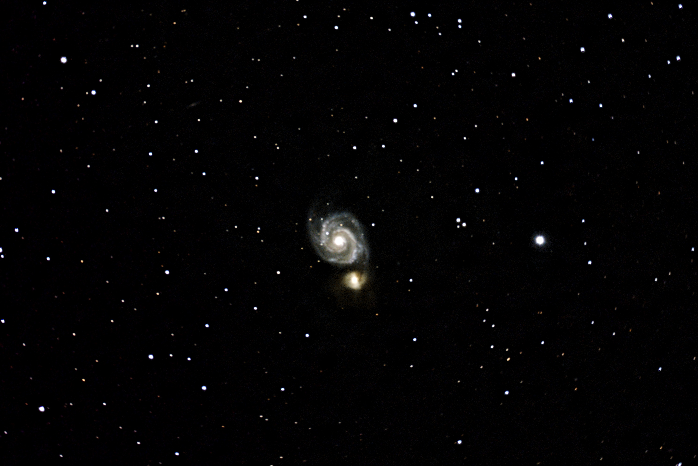
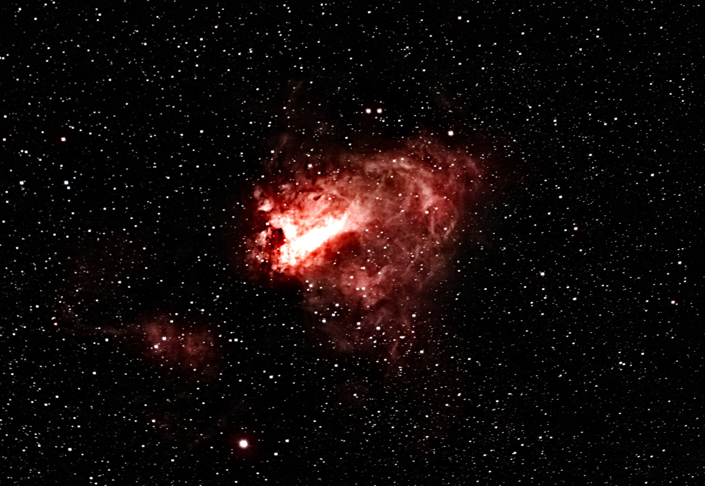
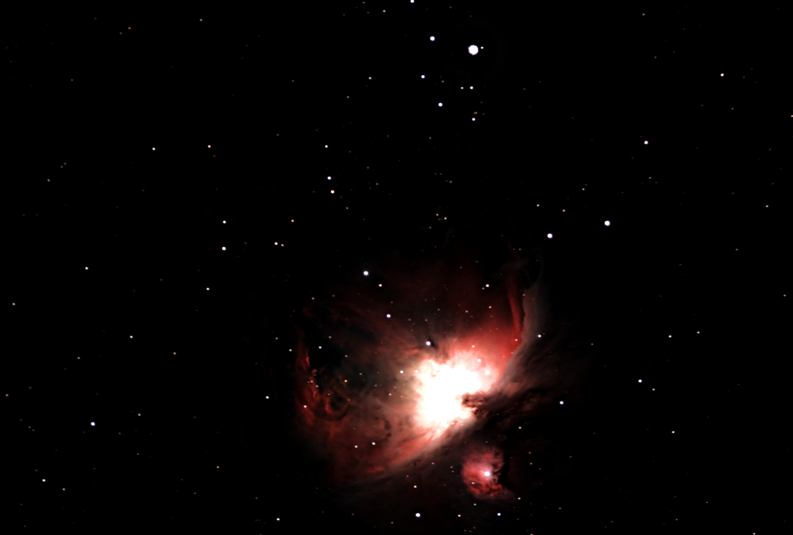
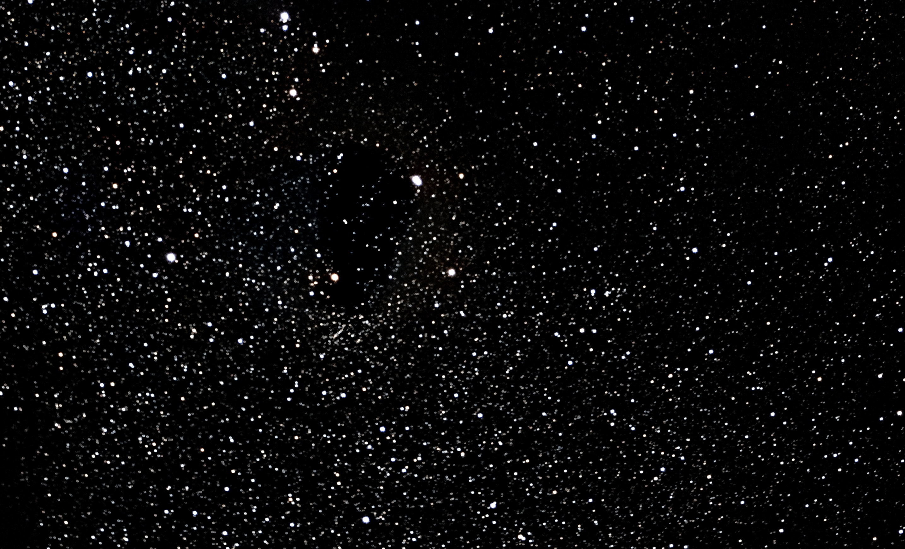

<p align="center">
  <picture>
    <source media="(prefers-color-scheme: dark)" srcset="assets/logo-dark.png">
    
  </picture>
</p>

**Streaming FITS stacker for astrophotography — runs on ordinary hardware, scales to any frame count.**

[](https://github.com/hd152/originstack/actions/workflows/ci.yml)
[](https://github.com/hd152/originstack/releases/latest)
[](LICENSE)

[**Website**](https://hd152.github.io/originstack/) · [Download](https://github.com/hd152/originstack/releases/latest) · [Changelog](CHANGELOG.md) · [Code signing policy](CODE_SIGNING_POLICY.md)

OriginStack is a full-featured Python pipeline for stacking and processing astronomical images, built from scratch: no OpenCV, scikit-image, PyWavelets, astroalign, astroquery or ONNX runtime — just NumPy, SciPy, Astropy and Pillow. The hot paths run in **Rust**: 80+ multi-threaded native kernels, ~5–150× faster than NumPy/SciPy, about 1.5–1.8× faster end to end on real sessions (see [Performance](#performance)), with a pure-NumPy fallback wherever the module isn't built. It was designed for the Celestron Origin smart telescope but works with any OSC/DSLR/mirrorless camera. Reads FITS, camera RAW (CR2/CR3/NEF/ARW/DNG/ORF/RW2/RAF/PEF/3FR/MRW/X3F/IIQ — needs `rawpy`), TIFF (needs `tifffile`), XISF, and SER (planetary/lucky-imaging video) — mix and match formats freely within one input directory. The core design principle is a **streaming architecture**: frames are loaded, processed, and freed one at a time, so memory usage stays constant regardless of how many frames you have.

---

## Sample Results

| Galaxy | Emission Nebula |
|:---:|:---:|
|  |  |
| *Whirlpool Galaxy (M51)* | *Omega Nebula (M17), 114 x 30 s* |

| Emission / Reflection Nebula | Star Cloud |
|:---:|:---:|
|  |  |
| *Orion Nebula (M42), seven sessions combined* | *Sagittarius Star Cloud (M24), 138 x 10 s* |

All stacked and processed entirely with OriginStack from raw Celestron Origin FITS frames (`--preset galaxy` for the Whirlpool, `--preset nebula` for the two nebulae, `--preset starfield` for the star cloud -- see [Usage Examples](#usage-examples)). The Orion Nebula is a hierarchical multi-session combine: each night is stacked separately, registered onto the deepest one, merged, and post-processed once.

**Sky conditions.** These are backyard/rooftop sessions under **Bortle 7-9** skies (heavy light pollution, urban/suburban), not a dark site -- measured per session with `estimate_bortle()` (`src/quality.py`, a rough same-equipment sky-glow bucket from calibrated background level vs. exposure/gain; not survey-grade photometry, see the function's docstring for what it isn't). None of the samples above -- or the two added for the [Andromeda Galaxy and Horsehead/Flame Nebula](https://hd152.github.io/originstack/#gallery) gallery entries on the website -- were shot from a dark site. The pipeline's background extraction, sky-floor correction and gradient removal are what make these usable at all under that much sky glow.

---

## Sample Output

<details>
<summary>Click to expand — a default run on 81 Black Eye Galaxy frames (excerpts)</summary>

```
Input:  C:/source/Astrophotography/Black_Eye_Galaxy_2026-03-14_21-20-36
Native accel: astro_native ACTIVE - Rust kernels (stacking combine, Lanczos warp, aniso diffusion)

Discovering frames...
  Mode: Single folder
  Found 84 FITS files: 81 lights, 1 darks, 1 flats, 1 bias

Creating master calibration frames...
  [OK] Master bias:  1 frames -> 2048x3056
  [OK] Master dark:  1 frames -> 2048x3056
  [OK] Master flat:  1 frames -> 2048x3056
  [OK] Hot pixel map: 214576 pixels from dark frame
    Bias:  pedestal=4990.7 ADU  noise=0.8 ADU  -> Good (low read noise)
    Dark:  median=4917.1 ADU  (163.9030 ADU/s)  temp=31.3°C/88.3°F  exp=30.0s  ISO=200  -> Poor (warm sensor — cool camera or use shorter darks)
    Flat:  R=0.819/G1=1.192/G2=1.201/B=0.987  vignetting=3.4%  -> Good (low vignetting)
  Session info (info.json):  object='Black Eye Galaxy'  bayer=RGGB  WCS=yes  GPS=yes

======================================================================
PHASE 1: PROCESSING & QUALITY ANALYSIS
======================================================================
  Processing 81 frames in parallel (5 workers x 2 native threads)...
  CFA equalisation: session-constant from 8 frames (G2 gain 1.00142, 2x2 green offsets -0.66, +0.85, +0.85, -1.05 ADU)
  [OK] Accepted: 80/81 (98.8%)
  [X] Rejected: 1 (Statistical outlier: 1)

  Target: Black Eye Galaxy [Galaxy]  conf=100%  source=session

  Auto Advisor: detected 'Galaxy'
    Blend: 75% Galaxy, 4% Globular Cluster, 4% Planetary Nebula
  Applied auto settings:
    * galaxy_mode  False -> True
    * stack_method  'auto' -> 'sigma_clip'
    * rejection_sigma  3.0 -> 2.8
    ...

======================================================================
PHASE 2: REGISTRATION
======================================================================
  Reference frame: Light0055.fits (score=45.4)
  Consensus reference: Light0045.fits (best quality in the middle of the session)
  Residual RMS threshold: 6.0px (adaptive: ref FWHM=7.1px, SNR=1.7)
  Transparency (relative flux of a fixed star ensemble, session median = 1.00): min 0.96  p10 0.98  max 1.03

======================================================================
PHASE 3: STACKING
======================================================================
  Method: sigma_clip
    [rust] fused patch-weighted + sigma-clip combine (4.4s)
    proper coadd: 80/80 frames, PSF FWHM 6.97-8.55 px (median 7.94), transparency 0.90-1.11
  WCS: session info.json solve refined against Gaia (94 stars, rms 0.422 px)

  Colour calibration: R x0.739 G x1.000 B x1.114 (48 Gaia stars, white = G2V, B-R scatter 0.074 mag)

======================================================================
PHASE 4: POST-PROCESSING
======================================================================
  [OK] Per-channel hot pixel removal: 34 pixels fixed (1.2s)
  [OK] Dynamic Background Extraction (8.7s)
  [OK] Chroma noise reduction (1.6s)
  [OK] Sky pedestal: +702.11 (sky sigma=87.70)
  [OK] Directional wavelet denoise (2.3s)
  [OK] Star reduction (0.6s)
  [OK] Local contrast enhancement (1.6s)
  [OK] Sky flattened + neutralised to grey

======================================================================
SUMMARY
======================================================================
  Frames stacked:   80 (98.8%)
  Integration time: 26.7 minutes
  Output:           Black_Eye_Galaxy_2026-03-14_21-20-36_stacked.fits (2034x2989x3)
  Avg FWHM:         8.17 px (best: 6.95)
  Avg SNR:          1.7 (best: 1.8)
  Processing time:  2m 43.2s
```

</details>

---

## Features at a Glance

### Core Pipeline
- **Four-phase pipeline**: quality analysis → registration → stacking → post-processing
- **Streaming memory model**: ~0.4–1.2 GB for 50 × 4K frames (vs 10–20 GB with traditional approaches)
- **Automatic calibration**: bias, dark, and flat master frames built and applied automatically
- **Parallel processing**: multi-core via `ProcessPoolExecutor`; GPU acceleration via CuPy (`--use-gpu`)

### Input Formats
- **FITS** — always supported, no extra dependencies
- **Camera RAW** (CR2, CR3, NEF, ARW, DNG, ORF, RW2, RAF, PEF, 3FR, MRW, X3F, IIQ) — needs `pip install rawpy`; reads the undemosaiced sensor mosaic, so RAW lights go through the same debayer step as OSC FITS
- **TIFF** (16/32-bit) — needs `pip install tifffile`; common intermediate/export format from N.I.N.A., SharpCap, PixInsight, DeepSkyStacker
- **XISF** (PixInsight's native format) — no extra dependency; OriginStack can also write XISF (`--export xisf`)
- **SER** (FireCapture/SharpCap planetary/lucky-imaging video) — no extra dependency; each `.ser` file's frames are treated as individual lights
- Formats can be freely mixed within one input directory — calibration matching, quality filtering, and stacking don't care what format a frame came from

### Registration & Alignment
- Coarse-to-fine pyramid seed + sub-pixel FFT residual correlation (~0.05 px accuracy)
- **Affine registration** via star matching + RANSAC — corrects rotation, scale, and translation
- Automatic dither detection → selects sigma-clip stacking automatically
- Crops to the valid common region across all frames (no black borders)
- Sampled post-registration residual verification, escalating to all frames on failure; frames whose measured alignment error still exceeds threshold are dropped by default (`--no-reg-residual-reject` to keep them)
- The affine fit itself is sanity-checked (shift/rotation bounds) before use, falling back to translation-only registration on a bad RANSAC match instead of applying it uncorrected
- **Frames a rotating field breaks are rescued, not dropped**: on an alt-az mount the pyramid shift (translation only) returns garbage for a rotated frame; flagged frames are now registered by a blind rigid star match (a real session had 34 of 148 frames stacked at the wrong position before this)
- **The residual gate cannot reject a whole session**: if the absolute threshold would fail most frames, frames are judged against the session's own residual spread instead
- **Per-frame transparency** — the median flux of a fixed star ensemble relative to the session median, measured after registration; `--transparency-min 0.8` drops frames thinned by cloud/haze that the FWHM/SNR gates miss
- **Session-wide distortion model** (`--distortion-model`, off by default) — one radial distortion (two coefficients) fitted from every frame's star matches and applied as per-frame corrections in the same single resample pass; only applied if it clearly helps on frames the fit did not see
- **Elastic (non-rigid) local registration** (`--elastic-registration`, off by default) — fits a smooth per-frame local displacement field from matched-star residuals, correcting spatially-varying distortion (differential atmospheric refraction, field rotation, tube flexure) a single global affine can't. Composed into the same single resample pass as the affine warp (no extra blur pass), and works under `--drizzle-scale` too

### Stacking Methods
| Method | Best For |
|--------|----------|
| `auto` *(default)* | Percentile rejection under 15 frames, sigma-clip above (tighter from 20 frames) |
| `sigma_clip` | Most sessions (MAD-based iterative rejection) |
| `winsorized` | Like sigma_clip but clips to the boundary instead of rejecting |
| `percentile` | Small sessions: reject outside a percentile range |
| `esd` | Small sessions (generalized ESD / Grubbs test) |
| `linear_fit` | Linear Fit Clipping (robust to non-Gaussian tails) |
| `ivw` | Inverse-variance weighting by each frame's measured noise, no rejection (`--uncertainty-map` writes the per-pixel error) |
| `wavelet` | Wavelet-subband combine |
| `median` | Robust, no tuning required |
| `mean` | Fastest, no rejection |

After the combine, **proper image coaddition** (Zackay & Ofek 2017, on by default, `--no-proper-coadd` to turn off) recombines the frames weighting each spatial frequency by that frame's measured PSF, transparency and noise: sharper stars at no noise cost on the benchmark sessions.

Drizzle super-resolution (`--drizzle-scale 2.0`) uses Lanczos-3 sub-pixel accumulation by default; `--drizzle-kernel {psf,magic}` swaps in a PSF-matched or ringing-free Magic-Kernel footprint, and `--super-res-iters N` adds iterative back-projection refinement. `--drizzle-method splat` uses true area-overlap drops instead of a Lanczos gather (~6x faster, softer, no ringing); the default resample path accumulates in one native pass (1.4x, 3.9x with `--drizzle-pixfrac < 1`, same output).

### Quality Filtering
- Per-frame metrics: brightness, contrast, star count, FWHM, SNR, composite score
- Score-based rejection: frames scoring below 50% of the session's 90th-percentile reference are dropped (`--quality-threshold`)
- Hard rejection: blank, corrupt, or severely underexposed frames
- Quality-weighted stacking (SNR, FWHM, star count weighting)

### Post-Processing Chain
Applied in order after stacking. Steps marked ✅ are on by default; ❌ must be explicitly enabled:

1. ✅ Hot pixel removal on stacked image
2. ✅ Star mask generation (protects structure in subsequent steps)
3. ✅ Background extraction (DBE via Gaussian-weighted local-linear regression with Tukey-biweight IRLS, bounded by construction; or legacy mesh/wavelet)
4. ✅ Chroma noise reduction (fine pass; optional coarse pass for medium-scale colour blotches, auto-set for galaxy targets)
5. ✅ Sky floor normalisation (per-channel pedestal removal)
6. ✅ Sky residual correction (second pass after background extraction)
7. ✅ Sky pedestal — lift the background off zero before the non-negativity clips (prevents black-hole clipping)
8. ✅ Wavelet denoising — curvelet-inspired directional BayesShrink (`--denoiser wavelet`; `--wavelet-protect 0` turns the structure protection off; `--denoiser curvelet` is an alias)
9. ❌ Bilateral filter — `--denoiser bilateral`
10. ❌ ACDNR adaptive contrast denoising — `--denoiser acdnr`
11. ❌ Perona-Malik anisotropic diffusion — `--denoiser aniso` (native/Rust accelerated)
12. ❌ Subtractive Chromatic Noise Reduction — `--scnr`
13. ❌ Photometric colour calibration — `--photometric-calibration` (gray-locus; skipped when the stack was already calibrated against Gaia, see below)
14. ❌ Deconvolution — `--deconvolve rl|tv|rl-sv|sparse` (RL is GPU-accelerated with `--use-gpu`; `rl-sv` is spatially-variant, `sparse` is FISTA in this project's wavelet basis)
15. ✅ Star reduction (narrows each star's profile, keeping its peak, colour and the surrounding noise) — `--no-star-reduce` to disable
16. ✅ Multiscale local contrast enhancement (MLCE) — `--no-local-contrast` to disable
17. ✅ Edge-band correction (`--skip-step edge_bands`) — removes the sky excess that rises toward the frame edges, then the final sky flattening + neutralisation (masked large-scale per-channel background → neutral grey)

Opt-in variants of the chain: `--starless-process` runs the denoisers and local contrast (and deconvolution, if enabled) on a starless copy and adds the stars back untouched; `--layered-stretch` takes the preview's black/white points from a starless copy so a faint galaxy or nebula owns the tonal range instead of being squeezed under the stars' white point.

> The auto-advisor enforces a **single primary luma denoiser** (the curvelet
> wavelet, with ACDNR only as the fallback sky smoother) — layering several
> full-frame smoothers erodes faint structure without adding selectivity. Pick
> explicitly with `--denoiser`. NLM, BM3D and MMT were removed after a
> ground-truth benchmark (`tools/bench_denoise_quality.py`): NLM damaged star
> cores, MMT erased fine structure, BM3D was slow and licence-encumbered.

### Presets
Eight built-in presets set a group of parameters at once (any flag you pass still wins). `--auto` (on by default) then tunes the rest for the detected target, so a preset is rarely needed:

```bash
--preset galaxy       # sigma-clip, deconvolution, star reduction, stronger GHS stretch
--preset nebula       # sigma-clip 2.5, wavelet + ACDNR denoising, stronger GHS stretch
--preset narrowband   # tuned for Ha/OIII/SII: tighter rejection, no chroma NR
--preset starfield    # no star reduction or local contrast, gentle stretch
--preset planetary    # mean stack, no background extraction, deconvolution
--preset lunar        # mean stack, no background extraction, linear stretch
--preset quick        # mean stack (no outlier rejection), lighter processing (fastest)
--preset quality      # sigma-clip 2.5, per-frame cosmic-ray rejection, deconvolution (slower)
```

`--preset quality` is not "the best": the defaults are the settings measured to help. Its per-frame cosmic-ray pass costs minutes for well under 1% change on deep rejection stacks, and deconvolution did not help at typical Celestron Origin signal-to-noise.

### Advanced Features
- **Plate solving** built in, against a local Gaia DR3 index (no API key, works offline once the index covers the field), or via ASTAP / nova.astrometry.net — writes WCS to FITS header, identifies objects via SIMBAD
- **Re-run post-processing only** (`--from-stack STACK.fits`) — Phase 4 on an earlier run's linear stack, with that run's saved settings; no light frames needed
- **Colour calibration against Gaia DR3** — on by default when the stack has a sky position (the session solve, refined against Gaia) and the run is online: each star's measured colour is fitted against its Gaia BP-RP on the linear stack, and the channels scaled so a Sun-like (G2V) star is white. `--no-color-calibrate` turns it off; the gray-locus method (`--photometric-calibration`) is the fallback
- **Colour-preserving stretch** (`--stretch-color preserve`, default) — the preview curve is applied to brightness only, so stars and galaxy cores keep their colour instead of washing out to white; `--stretch-color channel` restores the old per-channel curve
- **Aperture photometry** (`--photometry`) — calibrates the stack against Gaia DR3: per-channel zero points (optional colour terms), airmass from the `info.json` GPS + time, a Poisson error term from raw bias/flat pairs, and a `<output>_photometry.csv` star catalogue with magnitudes + uncertainties
- **Differential light curves** (`--photometry-timeseries`) — aperture-photometers a fixed Gaia star list on every registered sub and ensemble-calibrates, writing per-frame + per-star CSVs with a variability flag; `--photometry-target "RA,DEC"` reports one star
- **Banding removal** (`--banding-removal`) — per-row/column offsets removed from each calibrated Bayer frame before debayering, per colour plane, only where significant; a clean frame is left essentially untouched
- **Session diagnostics report** (`--session-report`) — `<output>_session.png` + `.csv`: FWHM, transparency, SNR, background, drift, field rotation, ellipticity, residual and temperature against time, with the drift rate, any periodic tracking error, the rotation rate and any focus-vs-temperature drift printed
- **Noise validation** (`--noise-validate`) — stacks the odd and even frames separately; their difference is an empirical noise map (`<output>_noise.fits`) and their local correlation shows which structure is repeatable (`<output>_consistency.fits`)
- **Moving objects** (`--moving-objects`, `--moving-objects-stack`) — links per-frame residuals into asteroid-like tracks by voting in velocity space; optionally stacks a window along each track so a mover too faint for any one frame comes up out of the noise
- **Light-curve analysis** (`--lightcurve-analysis`, with `--photometry-timeseries`) — Lomb-Scargle period search with a false-alarm probability and a box-least-squares + trapezoid transit fit with errors and a BIC test
- **Bayer-aware drizzle** (`--cfa-drizzle`, opt-in) — recombines each frame's *measured* colour samples instead of debayer-interpolated ones (native kernel, 15.7× the numpy path). On well-sampled data it trades 13% lower luma noise for 2× colour noise and no sharpness gain, so it is meant for undersampled data
- **Comet nucleus tracking** — dual-registered stacks (`_comet.fits`)
- **HDR combining** — blends short/long exposure stacks for high-dynamic-range targets
- **Mosaic stitching** — WCS-based reprojection via `reproject` (`--mosaic`)
- **Incremental stacking** — fold previous nights' saved stacks into tonight's run in seconds (`--merge`); output chains into future merges. Stacks from different exposure/ISO are mapped onto one flux scale first and weighted by measured noise, not frame count
- **Multi-session (hierarchical) runs post-process the combined stack** — the combined output goes through Phase 4 with the reference session's settings, and the reference grid is the session with the most integration time
- **Desktop app** — a native window (`python desktop_app.py`, or the packaged `OriginStack.exe`): pick the target from picture cards and a run mode, see what the run will do before you start, then follow phase progress, the log, per-frame quality and an interactive preview (zoom/pan, before/after wipe compare) — see [Desktop App](#desktop-app) below
- **Collection quality sweep** — recursively score every light in a folder tree and rename poor frames to `*.fits.rejected` (`--quality-sweep`, dry-run by default, reversible with `--sweep-undo`)
- **Checkpointing** — save raw pre-post stack for iterative post-processing (`--keep-checkpoint`); coalesces with `--merge` for fast tuning of merged stacks
- **Diagnostic snapshots** — FITS snapshots before each post-processing step (`--debug diagnostic`)
- **Quality CSV** — per-frame metrics exported for external analysis (`--quality-report`)
- **Galaxy/extended-source exclusion masking** (`--galaxy-mode`, `--galaxy-center X,Y`) — protects a galaxy's broad halo from background extraction, so it isn't fit and subtracted as gradient; auto-enabled for galaxy targets by `--auto`
- **Robust-PCA master calibration** (`--master-method robust_pca`, `--flat-from-lights`) — separates true shared calibration pattern from session-specific outliers (dust motes, transient hot pixels) instead of a per-pixel median
- **Real-time and streaming stacking** — `--live` folds new subs into a running stack as they land; `--stream` two-pass streams an already-complete large directory at O(1) full-resolution memory
- **Object annotation** (`--annotate`) — labels bright stars and named deep-sky objects on a copy of the preview, using a WCS solution

---

## Installation

Requires Python 3.10+ (CI tests 3.11 and 3.12; the optional native extension targets the CPython 3.10 ABI).

```bash
# 1. Clone the repo
git clone https://github.com/hd152/originstack.git
cd originstack

# 2. Create a virtual environment (recommended)
python -m venv .venv
source .venv/bin/activate       # Linux/macOS
.venv\Scripts\activate          # Windows

# 3. Install core dependencies
pip install -r requirements.txt

# 4. Optional but recommended: native (Rust) acceleration of the hot paths
#    (otherwise they run in NumPy). Needs a Rust toolchain + maturin.
#    See "Native (Rust) acceleration" below.
pip install maturin
cd ext/astro_native && maturin develop --release   # into a venv

# 5. Optional: GPU support (NVIDIA + CUDA) -- pick the CuPy wheel for your CUDA version
pip install cupy-cuda12x
```

Plate solving needs nothing extra: the built-in solver uses a local Gaia star index (see [Plate Solving](#plate-solving)).

**Optional dependencies** — all gracefully degraded when absent:

| Package | Feature |
|---------|---------|
| `psutil` | Memory-adaptive worker/memmap sizing (guarded with a fixed fallback everywhere) |
| `rawpy` | Camera RAW input (CR2/CR3/NEF/ARW/DNG/…) |
| `tifffile` | TIFF input and `--export tiff` output |
| `reproject` | Mosaic stitching (`--mosaic`) |
| `certifi` | Up-to-date CA certificates for the HTTPS lookups (Gaia, SIMBAD, astrometry.net), on systems whose own store is missing or stale |
| `tomli` | Reading `--config` TOML files on Python 3.10 (3.11+ has `tomllib` built in) |
| `cupy-cuda*` | GPU acceleration (`--use-gpu`; see [GPU Acceleration](#gpu-acceleration)) |
| `astro_native` (Rust) | 80+ native kernels: stacking combines (incl. Linear Fit Clipping, inverse-variance-weighted, proper coaddition), Lanczos warp (alignment + drizzle), RCD / Malvar / Menon2007 debayer, calibration and hot-pixel passes, L.A.Cosmic, median filters, DBE, anisotropic diffusion, bilateral filter, matched-filter star detection, rigid-transform RANSAC, 2D wavelet transform, blind star-pattern match, 1D + 2D Moffat/Gaussian PSF fits, aperture photometry, and `--transient-triage` inference (pure-Rust `tract` ONNX) |

`opencv-python`, `astroalign`, `scikit-image`, `PyWavelets`, and `astroquery` are not used anywhere in this codebase — the debayers and the bilateral filter are native Rust kernels (numpy fallback if `astro_native` isn't built); `--merge`'s cross-night registration (arbitrary field rotation between nights) is `src/blind_match.py`, also native; Richardson-Lucy's CPU fallback and satellite-trail detection are native/numpy; the wavelet denoiser and multiscale-entropy seeing metric's transform are native (`src/wavelet.py`); every network catalogue lookup (astrometry.net, Gaia, VizieR, SIMBAD, JPL Horizons) is direct HTTP via `src/net_query.py` (stdlib urllib) — no dependency for any of them.

---

## Quick Start

### Single folder of lights

```bash
python originstack.py -d lights/ -o stacked.fits
```

OriginStack will automatically detect any calibration frames (`dark_*.fit`, `flat_*.fit`, `bias_*.fit`) in the same directory, build master frames, stack the lights, and write a FITS file and a preview JPEG.

### Verbose output with quality metrics

```bash
python originstack.py -d lights/ -o stacked.fits -v
```

Shows per-frame brightness, contrast, star count, SNR, and shift magnitude as each frame is processed.

### Auto target detection

`--auto` is **on by default**: after Phase 1 it recognises the target (from the session `info.json`, the FITS `OBJECT` header, the folder name and SIMBAD, then the frames themselves) and tunes the settings for it. Tell it what you imaged with `--target-type` when it guesses wrong, or turn it off with `--no-auto`:

```bash
python originstack.py -d lights/ -o stacked.fits --target-type globular_cluster
```

Explicit flags always win over what `--auto` picks.

### Several sessions of the same target

```bash
python originstack.py -d m51_sessions/ -o m51.fits -v
```

Where `m51_sessions/` contains one subfolder per night. The sessions are pooled into one stack, or, when field rotation between them would crop the corners, stacked separately and merged onto one grid. See [Folder Organization Modes](#folder-organization-modes).

---

## Desktop App

A native window for anyone who'd rather not memorize CLI flags:

```bash
python desktop_app.py
```

On Windows, the packaged build needs no Python install at all: download `OriginStack-<version>-setup.exe` from the [latest release](https://github.com/hd152/originstack/releases/latest) and run it (per-user install, Start Menu entry, uninstaller). Prefer the zip? **Extract all of it** first and run `OriginStack.exe` from the extracted folder — running the exe from inside the zip preview fails with "Failed to load Python DLL". On Linux, download `OriginStack-<version>-linux-x64.tar.gz` (and its `.sha256`) from the same page, extract it and run `./install.sh` (per-user install, application-menu entry, `./install.sh --uninstall` to remove); it needs glibc 2.35 or newer and has had less real-world use than the Windows build. See [Packaging](packaging/README.md).

The window has two columns:
- **Left — Setup + Log**
  - Pick the light-frames folder; the app counts the frames and suggests the target from the session's `info.json`, FITS header or folder name.
  - **What did you image?** Picture cards (Auto-detect, Galaxy, Nebula, Star cluster, Star field, Comet) and **How should it run?** (Full quality, or Quick look for a faster check).
  - The most-used settings, each with a one-line description. **Additional options** holds the rest of the CLI flags, grouped and searchable; the form is generated from the same argument parser the CLI uses, so it never drifts out of sync. A dot and a **reset** link mark anything changed from its default. Diagnostics and experimental options stay hidden until you tick **Expert options**.
  - Below, in a pane you can resize: Start, the pipeline phase bar and the live log — the same output you'd see on the command line.
- **Right — Preview + frames**
  - Before a run: an example result for the chosen target, and a **This run** summary of what Start will do (frames, target, mode, changed settings, output file).
  - During and after a run: the stacked result, updated live at each milestone. Scroll to zoom, drag to pan, toggle **Compare** to wipe between two milestones (e.g. the linear pre-post-processing stack vs. the final result). Below it, a per-frame thumbnail strip and a running table of per-frame quality (score, SNR, star count, FWHM).

Leave **Output file** blank and the stack is saved next to the light-frames folder, never overwriting an earlier one.

Closing the window while a run is in progress asks for confirmation first; a native OS notification fires when a run finishes, so you don't have to keep the window in view.

---

## Usage Examples

### Galaxy (e.g., M51, M81)

```bash
python originstack.py -d lights/ -o galaxy.fits --target-type galaxy -v
```

`--target-type galaxy` tells `--auto` what it is (it would usually work it out from the session anyway): the galaxy's halo is kept out of background extraction, and stars are trimmed. `--deconvolve rl` can sharpen spiral arms on bright, high signal-to-noise data; on typical Celestron Origin sessions it was measured not to help.

### Emission nebula (e.g., Orion, Rosette)

```bash
python originstack.py -d lights/ -o nebula.fits --target-type emission_nebula -v
```

### Narrow-band (Ha/OIII/SII)

```bash
python originstack.py -d ha_lights/ -o ha_stack.fits \
  --preset narrowband \
  --white-balance none \
  --scnr \
  --stack-method sigma_clip --rejection-sigma 3.0 \
  -v
```

### Planetary / lunar

```bash
python originstack.py -d frames/ -o jupiter.fits \
  --preset planetary \
  --deconvolve rl \
  --no-background-extraction \
  --no-star-reduce \
  -v
```

### Star field / open cluster (e.g., Pleiades, double cluster)

```bash
python originstack.py -d lights/ -o starfield.fits \
  --preset starfield \
  --stack-method sigma_clip \
  -v
```

The `starfield` preset skips star reduction (the whole point of the target)
and keeps post-processing minimal so points stay sharp and colour-true.

### Globular cluster (e.g., M13, M4) / reflection nebula (e.g., M78)

```bash
python originstack.py -d lights/ -o cluster.fits --target-type globular_cluster -v
python originstack.py -d lights/ -o m78.fits --target-type reflection_nebula -v
```

Neither has a preset; `--target-type` gives `--auto` the type, and it blends in matching denoise/stretch settings.

### Incremental stacking — add tonight's frames to a saved stack

```bash
# First night: normal run; the output FITS is a mergeable linear stack
python originstack.py -d night1/ -o m51.fits --auto -v

# Later nights: process only the new frames, fold in the saved stack (seconds)
python originstack.py -d night2/ -o m51_v2.fits --auto --merge m51.fits -v
```

Each previous stack is registered onto the new session's grid (handles
cross-night field rotation via a blind rigid star-pattern match, no
assumption about the angle), mapped onto the new stack's flux scale (so
sessions with different exposure or ISO combine correctly), and combined as a
per-pixel mean weighted by each stack's measured noise. The output chains into
future merges.

### Super-resolution drizzle (requires dithered frames)

```bash
python originstack.py -d lights/ -o drizzled.fits \
  --drizzle-scale 2.0 \
  --drizzle-pixfrac 0.7 \
  -v
```

### Plate solving

Colour calibration against Gaia needs no flag: it is on by default whenever the stack has a sky position (a Celestron Origin session always does) and the run is online.

```bash
# Built-in solver: no API key needed (see "Plate Solving" below)
python originstack.py -d lights/ -o stacked.fits \
  --plate-solve \
  -v
```

### Session diagnostics and the optional analyses

```bash
# How did the night go? Drift, rotation, focus trend, transparency
python originstack.py -d lights/ -o stacked.fits --session-report

# Drop frames thinned by cloud (relative flux < 0.8), remove sensor banding
python originstack.py -d lights/ -o stacked.fits --transparency-min 0.8 --banding-removal

# Look for asteroids and stack along the first tracks
python originstack.py -d lights/ -o stacked.fits --moving-objects-stack

# Measured noise + which structure is repeatable, session-wide distortion fit
python originstack.py -d lights/ -o stacked.fits --noise-validate --distortion-model

# Period/transit search on the light curves (needs a session WCS)
python originstack.py -d lights/ -o stacked.fits --photometry-timeseries --lightcurve-analysis
```

### Debug registration problems

```bash
python originstack.py -d lights/ -o stacked.fits --debug registration
```

Writes PNG overlay images and shift statistics to `_registration_debug/`. Use this when frames aren't aligning correctly.

### Clean up a collection — flag poor lights

```bash
# Dry run: walk the whole tree, score every light, report what would be flagged
python originstack.py --quality-sweep -d "G:\astro\Astrophotography"

# Apply: rename flagged frames to *.fits.rejected (invisible to stacking)
python originstack.py --quality-sweep -d "G:\astro\Astrophotography" --apply

# Change your mind: restore every flagged file
python originstack.py --sweep-undo -d "G:\astro\Astrophotography"
```

Uses the exact same quality gate as stacking: hard failures (no stars, SNR < 0.5,
near-zero contrast), statistical outliers vs each folder, and scores below
`--quality-threshold`% of the folder's 90th-percentile reference.

### Health check without stacking

```bash
python originstack.py -d lights/ --health-check
```

Analyses calibration quality (bias noise, dark thermal current, flat vignetting) and reports any ISO or dimension mismatches — without actually stacking anything.

### Reuse a run's settings

Every run saves its effective settings next to the output as `<output>_config.toml` (including what `--auto` chose):

```bash
# See the resolved parameters without processing anything
python originstack.py -d lights/ -o stacked.fits --target-type galaxy --dry-run

# Reapply an earlier run's settings to new data
python originstack.py -d lights2/ -o stacked2.fits --config stacked_config.toml
```

A saved config fixes `--auto`'s choices for the session it came from; re-running with `--auto` on different data is not the same thing.

---

## Folder Organization Modes

OriginStack supports three ways of organizing your input files. Single folder and multiple sessions are auto-detected; mosaic needs a flag. Different targets go in separate runs.

---

### Mode 1 — Single folder

Put all your FITS files (lights and optional calibration frames) in one directory and point `-d` at it.

```
lights/
├── bias_001.fit          (optional)
├── dark_001.fit          (optional)
├── flat_001.fit          (optional)
├── light_001.fit
├── light_002.fit
└── ...
```

```bash
python originstack.py -d lights/ -o stacked.fits
```

OriginStack builds master calibration frames from any bias/dark/flat files it finds, then processes and stacks all light frames into a single output FITS.

---

### Mode 2 — Several sessions of one target (auto-detected)

Use this for the **same target across several nights**. Create one subfolder per session.

```
m51_sessions/
├── 2024-04-01/
│   ├── info.json          (optional — Celestron Origin metadata)
│   └── light_001.fit ... light_NNN.fit
├── 2024-04-03/
│   ├── dark_001.fit
│   ├── info.json
│   └── light_001.fit ... light_NNN.fit
└── 2024-04-07/
    ├── flat_001.fit
    ├── info.json
    └── light_001.fit ... light_NNN.fit
```

```bash
python originstack.py -d m51_sessions/ -o m51_deep.fits -v
```

OriginStack predicts from each session's metadata how far the field rotates between sessions (an alt-az mount rotates the field as the target tracks) and picks one of two ways to stack:

- **Pooled** (`--combine-sessions` to force): every light from every session is quality-analysed, registered and stacked together, with all calibration frames merged into shared masters. Used when the sessions line up.
- **Stacked separately, then merged** (`--hierarchical` to force): used when the sessions differ by more than 3° of field rotation beyond what any one session spans, because pooling would crop the output to the small region every frame covers. Each session is stacked on its own (its own calibration, quality analysis and registration), the stacks are registered onto the one with the most integration time by a rotation-agnostic star match, and post-processing runs once on the combined stack.

If the metadata can't be read, the sessions are pooled and the log says so.

**`info.json` support:** If a subfolder contains an `info.json` from the Celestron Origin app, OriginStack reads the target name, Bayer pattern, GPS position and WCS (RA/Dec/FOV/orientation) from it automatically. If the sessions report different Bayer patterns (e.g. mixing cameras), a warning is printed before stacking; per-frame FITS headers always take priority over `info.json` defaults.

---

### Mode 3 — Mosaic (`--mosaic`)

Use this when your subfolders are **adjacent sky panels** of the same large target, and you want them stitched into a single wide-field image using WCS reprojection.

```
panels/
├── panel_1/
│   ├── info.json          (provides WCS — or use --plate-solve)
│   └── light_001.fit ... light_NNN.fit
├── panel_2/
│   ├── info.json
│   └── light_001.fit ... light_NNN.fit
└── panel_3/
    ├── info.json
    └── light_001.fit ... light_NNN.fit
```

```bash
python originstack.py -d panels/ -o mosaic.fits --mosaic -v
```

Each subfolder is first stacked independently (phases 1–4), then all panel stacks are reprojected onto a common optimal WCS grid and blended with distance-weighted feathering to eliminate seams. Overlap zones are background-matched automatically.

**Requirements:**
- `pip install reproject` — WCS-based reprojection library
- Every panel must have a valid WCS: either from `info.json` (Celestron Origin) or from plate solving (`--mosaic` turns `--plate-solve` on)
- If any panel is missing a WCS, the mosaic step is skipped with a warning

---

### Auto-detection summary

| What's in `-d` | Mode selected |
|---|---|
| FITS files directly in the directory | **Single folder** |
| Subdirectories containing FITS files | **Several sessions**: pooled, or stacked separately and merged when field rotation would crop the corners |
| Subdirectories + `--combine-sessions` / `--hierarchical` | **Several sessions**, forced pooled / forced separate-then-merge |
| Subdirectories + `--mosaic` | **Mosaic** |

---

## Post-Processing Default Flags

Most post-processing is **on by default**. Here are the disable flags:

| Feature | Default | Disable with |
|---------|---------|-------------|
| Background extraction (DBE) | ✅ on | `--no-background-extraction` |
| Proper image coaddition | ✅ on | `--no-proper-coadd` |
| Luma denoising (wavelet) | ✅ on | `--denoiser none` |
| Chroma noise reduction | ✅ on | `--no-chroma-nr` |
| Star reduction | ✅ on | `--no-star-reduce` |
| Colour calibration against Gaia (online, needs a sky position) | ✅ on | `--no-color-calibrate` |
| Colour-preserving stretch | ✅ on | `--stretch-color channel` |
| Star removal (writes a `_starless.fits` sidecar; main output keeps stars) | ❌ off | `--remove-stars` |
| Local contrast enhancement | ✅ on | `--no-local-contrast` |
| Chromatic aberration correction | ✅ on | `--no-ca-correction` |
| Cosmic ray rejection | auto | `--cosmic-ray-rejection` / `--no-cosmic-ray-rejection` (auto-skipped on deep rejection stacks) |
| Quality filtering | ✅ on | `--no-quality-filter` |
| Affine registration | ✅ on | `--no-affine` |
| Elastic local registration | ⬜ off | `--elastic-registration` |
| Primary denoiser choice | auto (wavelet) | `--denoiser {wavelet,acdnr,bilateral,aniso,none}` |
| Deconvolution | ❌ off | `--deconvolve {rl,rl-sv,tv,sparse}` |

---

## CLI Reference (Abridged)

```
python originstack.py -d <dir> -o <output.fits> [options]
```

| Flag | Description |
|------|-------------|
| `-d, --directory` | Input directory (required unless `--from-stack`) |
| `-o, --output` | Output FITS path, or a folder to write `<session>_stacked.fits` into (default: `<session>_stacked.fits` in the current folder) |
| `--preset NAME` | Apply named preset (quick, quality, galaxy, nebula, narrowband, starfield, planetary, lunar) |
| `--config PATH` | Load parameters from TOML file |
| `--no-auto` | Disable the heuristic target classifier (on by default; detects target type and optimises settings automatically) |
| `--target-type TYPE` | Tell `--auto` what you imaged: galaxy, emission_nebula, reflection_nebula, planetary_nebula, globular_cluster, star_field, wide_field |
| `--stack-method METHOD` | Stacking algorithm (auto, mean, median, sigma_clip, percentile, esd, winsorized, linear_fit, ivw, wavelet) |
| `--debayer-method METHOD` | Debayer algorithm: rcd (default), malvar, menon2007 |
| `--white-balance METHOD` | White balance (grayworld, whitepatch, none) |
| `--bg-method METHOD` | Background extraction (dbe, mesh, wavelet; physical is experimental) |
| `--drizzle-scale N` | Super-resolution scale (1.0 = off, 2.0 = 2×) |
| `--elastic-registration` | Local (non-rigid) displacement correction on top of the global affine (off by default) |
| `--distortion-model` | One radial distortion for the whole session, applied per frame (off by default; skipped with `--elastic-registration`) |
| `--transparency-min 0-1` | Drop frames whose relative transparency is below this (0 = report only) |
| `--banding-removal` | Remove row/column banding from each calibrated frame (off by default) |
| `--cfa-drizzle` | Bayer-aware drizzle of the measured samples (opt-in; for undersampled data) |
| `--noise-validate` | Odd/even half-stacks: measured noise map + repeatable-structure map |
| `--moving-objects[-stack]` | Find asteroid-like movers; optionally stack along each track |
| `--session-report` | Write `<output>_session.png` / `.csv` diagnostics |
| `--lightcurve-analysis` | Period + transit analysis of `--photometry-timeseries` light curves |
| `--denoiser NAME` | Primary luma denoiser (auto — wavelet unless overridden —, wavelet, acdnr, bilateral, aniso, none; `curvelet` is an alias for `wavelet`) |
| `--wavelet-protect 0-1` | Structure protection for the wavelet denoiser (default 0.6; 0 = plain BayesShrink) |
| `--starless-process` | Denoise / local-contrast / deconvolve a starless copy, add the stars back untouched |
| `--layered-stretch` | Preview stretch points taken from a starless copy (preview JPEG only) |
| `--deconvolve {off,rl,rl-sv,tv,sparse}` | Richardson-Lucy (global or spatially-variant), TV, or sparse-wavelet deconvolution |
| `--plate-solve` | Plate solve (built-in local Gaia solver by default; `--plate-solver` picks ASTAP/astrometry.net) |
| `--from-stack STACK.fits` | Re-run post-processing only, on an earlier run's linear stack |
| `--spike-reject` | Remove cosmic-ray / hot-pixel spikes on the raw mosaic before debayering (cheap; `--auto` turns it on for < 20 frames, mean stacking or drizzle) |
| `--frame-store {auto,ram,disk}` | Keep per-session frame arrays in RAM when there is room (auto), always (ram), or in temp files (disk) |
| `--no-wcs-refine` | Keep the session `info.json` WCS as mapped onto the stack, without the Gaia refinement |
| `--gpu-phase1 {auto,on,off}` | With `--use-gpu`: run Phase 1 on the GPU or the CPU pool (auto picks) |
| `--comet-mode` | Also stack on the comet nucleus (`<output>_comet.fits`) |
| `--offline` | Make no network requests at all |
| `--no-proper-coadd` | Plain combine only, without proper image coaddition |
| `--hdr-combine PATH` | Blend short-exposure stack for HDR |
| `--mosaic` | Stitch per-subfolder stacks via WCS reprojection |
| `--merge STACK.fits [...]` | Incremental stacking: fold previous linear stacks into this run |
| `--quality-sweep [--apply]` | Recursively flag poor lights across a collection (dry-run by default) |
| `--keep-checkpoint` | Save raw pre-post-processing stack for re-processing |
| `--quality-report PATH` | Write per-frame quality metrics to CSV |
| `--dry-run` | Discover frames, show parameters, estimate resources — no processing |
| `--health-check` | Analyse calibration and frames without stacking |
| `--debug KIND[,..]` | Debug artefacts: registration, diagnostic, intermediates, masks |
| `--use-gpu` | Enable CuPy GPU acceleration |
| `-j N, --parallel N` | Worker count (0 = auto-detect) |
| `-v, --verbose` | Detailed per-frame output |

For the full CLI reference with all flags and defaults, see [PROJECT_SPEC.md](PROJECT_SPEC.md).

---

## Performance

Measured end to end on real Celestron Origin data (2048×3056 frames, Windows 11, an 8-core / 16-thread CPU with 16 workers), comparing this release against the development build just before its optimisation work (same data, same config, same machine, run back to back):

| Session | Before | Now |
|---------|--------|-----|
| Fireworks Galaxy, 148 × 10 s frames, single session | 3 min 50 s | 2 min 27 s – 2 min 40 s (**~1.5×**) |
| Orion Nebula, 7 sessions (456 frames) combined hierarchically | 15 min 12 s | 8 min 16 s (**~1.8×**) |

Where the time went on the Fireworks run:

| Phase | Before | Now |
|-------|--------|-----|
| Phase 1 — load, calibrate, debayer, quality | 98 s | 51–52 s |
| Phase 2 — registration | 41 s | 31–40 s |
| Phase 3 — align + stack | 51 s | 26–33 s |
| ↳ per-frame alignment (141 frames) | 30 s | 12–15 s |

Drizzle (2×, 29 frames of the same session, Lanczos-3 kernel, just the accumulation loop):

| Mode | Before | Now |
|------|--------|-----|
| Resample, `--drizzle-pixfrac 1.0` | 12 s | 11 s |
| Resample, `--drizzle-pixfrac 0.7` | 49 s | 12 s (**~4×**) |
| `--drizzle-method splat` (area-overlap drops, opt-in) | — | 2 s (**~6×** the resample loop) |

Notes on reading these numbers:

- The multi-session (hierarchical) win is mostly structural: Phase 4 used to run on every session's stack and then again on the combined one; it now runs once, on the combined stack.
- Phase 4 on a 2× drizzle output (a 3780×5952 image) still takes roughly 10 minutes and dominates a drizzle run; it was not sped up.
- Registration timing varies from run to run (31 s and 40 s on identical code), so treat it as unchanged.
- The final stacks are not bit-for-bit reproducible between two runs of the same code (registration is not deterministic), so speed comparisons were made on timings, with each optimisation separately checked against the code it replaced.
- Two later changes are not in the table above: debayer's G1/G2 gain and 2×2 green offsets are now measured once per session instead of on every frame (`--no-session-cfa-eq` restores the per-frame path), taking Debayer from ~1.26 s to ~0.45 s per frame under 16 workers; and the temporary frame memmaps are no longer flushed to disk just before being deleted. Together they cut a 158-frame run from 135 s to 126 s with a bit-identical stack.
- Memory stays bounded by the streaming architecture — frames are loaded one at a time and freed after accumulation (about one or two frames resident, plus the aligned-stack memmap on disk), so 500+ frame sessions run in the same working set.

### Compared with Siril and DeepSkyStacker

Same lights, same bias/dark/flat, one machine (Windows 11, 8-core / 16-thread CPU, 64 GB RAM), each tool at default-style settings. Three Celestron Origin sessions: Omega Nebula (114 × 30 s), Sunflower Galaxy (158 × 20 s) and Sculptor Galaxy (532 × 10 s). Reproduce on your own data with [`tools/bench_vs_siril.py`](tools/bench_vs_siril.py).

OriginStack first, Siril second. "Stack only" leaves out OriginStack's finishing steps (background extraction, denoising, stretch), which Siril's script does not have:

| Session | Stack only | OriginStack, finished image | Peak memory | Star width |
|---------|-----------|-----------------------------|-------------|------------|
| Omega, 114 frames | 68 s / 86 s | 90 s | 10.6 / 6.5 GB | 4.40 / 4.56 px |
| Sunflower, 158 frames | 84 s / 106 s | 107 s | 12.8 / 7.8 GB | 3.52 / 3.60 px |
| Sculptor, 532 frames | 169 s / 195 s | 184 s | 9.2 / 11.2 GB | 2.69 / 3.01 px |

- **Sharpness: sharper than Siril on all three.** On the same stars OriginStack is 4% narrower on Omega, 1.5% on Sunflower and 10% on Sculptor -- from proper image coaddition (on by default; Zackay & Ofek 2017) and a fix to a hot-pixel step that had been flattening the peaks of undersampled stars. It used 114/114, 158/158 and 532/532 frames; Siril used 111, 157 and 525.
- **Noise: quieter once sharpness is matched.** Blurring each OriginStack channel until its stars are exactly as wide as Siril's, its noise (R/G/B) is 0.81/0.88/0.89x Siril's on Omega, 1.00/0.75/0.93x on Sunflower and 0.97/0.92/0.89x on Sculptor. Unmatched, per pixel, a sharper stack reads noisier (up to 1.28x on Sculptor's blue).
- **Speed: faster than Siril on all three**, run back to back on the same machine, even though OriginStack also scores quality, white-balances and detects stars on every frame. Both tools' times moved by up to a third between identical runs over the day (Siril alone took 55-86 s on Omega), so compare within a row.
- **Memory and disk.** One worker per physical core; the aligned frames stay in memory when there is room. Siril uses less memory on the two shorter sessions, OriginStack less on Sculptor. Peak temporary disk: 11 / 15 / 63 GB against Siril's 17 / 23 / 57 GB.
- **DeepSkyStacker** took 14 min 8 s on Omega (defaults: plain average, no rejection), gave stars softer than both others (4.83 px against 4.56 for Siril on the same stars), and its stack showed horizontal hot-pixel streaks and a few misregistered frames. A tuned run would look better; it was not repeated.
- **Where OriginStack fits.** It finishes the image in the same run with no setup, explains the night ([diagnostics](docs/advanced.html)), runs fully offline on request (`--offline`) and does much that the other tools leave to you.

All three sessions were re-measured on 2026-10-02 with this version. Three sessions from one camera are a small sample.

How star width is measured matters more than it looks. It is a Gaussian fit to each of up to 400 bright, unsaturated, isolated stars, **at the same positions in both stacks and on each stack's own pixel grid** (no resampling), and the median is reported. An earlier version of this section compared each stack's FWHM over its own detected star list and concluded OriginStack's stars were tighter; that came from which stars were picked and was withdrawn. Measured properly, OriginStack's stars were then genuinely 13% wider than Siril's on Omega, until a hot-pixel filter that was clipping the cores of bright stars was found, by switching Phase 1 steps off one at a time, and fixed (see the changelog). Registration accuracy (about 0.1 px between frames), the warp kernel, rejection, weighting and normalisation were all checked and are not the cause of anything above.

Things these numbers do not show: three sessions from one camera are a small sample; Siril and DeepSkyStacker have many settings that were left alone; and DeepSkyStacker was not re-run after the fix.

### Native (Rust) acceleration

[`ext/astro_native/`](ext/astro_native/) is an optional PyO3/maturin crate of 80+ hot-path kernels, each with a numpy fallback (absent module → pure-Python path). It covers the Phase-1 calibration/cosmic-ray/debayer hot paths, the Phase-2/3 warp + combine hot path, drizzle, background extraction, star detection, RANSAC, several denoisers, the photometry aperture loop, PSF profile fitting, and `--transient-triage` inference (pure-Rust `tract` ONNX runtime — no Python ONNX dependency). A representative sample:

| Kernel | Speedup vs numpy/scipy |
|--------|------------------------|
| `sigma_clip_combine` (default stack method) | ~37× |
| `esd_combine` / `percentile_clip_combine` / `median_combine` | ~24× / ~13× / ~6× |
| Fused patch-weighted + sigma-clip combine | ~100× |
| Per-frame Lanczos-3 warp (alignment + drizzle resample) | ~5× / ~26× |
| Malvar debayer | ~2× |
| Phase 1 calibration (bias/dark/flat/finite check/clip, one pass) | ~4× single-thread (40 → 9 ms) |
| Bayer hot-pixel repair / hot-pixel map replacement | ~25× / ~55× single-thread (715 → 29 ms / 666 → 12 ms) |
| RGB hot-pixel repair (luma + median + MAD + replace, fused) | ~22× single-thread (1174 → 52 ms) |
| Per-frame pre-gradient removal | ~40× (349 → 8 ms) |
| Debayer stage as a whole (medians, G1/G2 + grid equalisation in place) | ~2.2× under 16 workers (2207 → 1002 ms/frame) |
| L.A.Cosmic cosmic-ray rejection | ~2× under real parallel load |
| Median filter (3×3 network / larger windows) | ~13× / ~26×; the 3×3 picks an AVX2 version at run time (a further ~1.7×) |
| DBE surface fit + patch sampler | ~2.4× / ~31× |
| Anisotropic diffusion | ~37× |
| Batch aperture photometry (`--photometry` / `--photometry-timeseries`) | ~150× |
| CFA drizzle frame splat (`--cfa-drizzle`) | ~15.7× (407 s → 26 s, 148 frames) |
| White balance (default Phase 1 step, bit-identical to numpy) | ~6.9× single-thread |
| Lanczos-3 warp of a rotated frame (alignment, drizzle) | ~5× vs the previous kernel (2187 → ~415 ms/frame), and Phase 3 now warps only the common crop |
| Fused drizzle accumulate / area-overlap splat | ~1.4× (3.9× with pixfrac < 1) / ~6× |

Most Phase 1 kernels are bit-identical to the numpy code they replace; the rotated Lanczos warp takes its weights from an interpolated table (99.985% of output values identical, the rest one ulp off — `ORIGINSTACK_LANCZOS_EXACT=1` restores the closed form). Speedups were measured single-threaded unless noted; under a full worker pool memory bandwidth, not arithmetic, is the limit, which is why the whole-stage figures are smaller than the single-kernel ones.

See CLAUDE.md's "Native (Rust) acceleration" section for the full kernel-by-kernel list.

Build (needs a Rust toolchain + `pip install maturin`):

```bash
# into a virtualenv:
cd ext/astro_native && maturin develop --release
# system Python (no venv): build a wheel and install it
cd ext/astro_native && python -m maturin build --release
pip install --force-reinstall target/wheels/astro_native-*.whl
```

At runtime the startup banner reports `Native accel: astro_native vX ACTIVE …`, and each accelerated step logs a `[rust] …` line. The aligned stack is a float32 memmap that Rust views zero-copy, so the streaming memory model is preserved. GPU (`--use-gpu`) additionally accelerates the registration warp and Richardson-Lucy deconvolution via cupy.

### Iterating on the same data

`--from-stack STACK.fits` re-runs only post-processing (Phase 4) on an earlier run's linear output, with that run's saved settings; flags you pass override them. No light frames are needed, and the slow early steps are cached next to the stack, so a re-run takes seconds to tens of seconds:

```bash
python originstack.py --from-stack stacked.fits -o tweak.fits --stretch arcsinh
```

An interrupted run resumes from its last checkpoint. With `--keep-checkpoint` the checkpoint also survives a successful run, so a re-run with different stacking settings reuses Phase 1 and one with different post-processing settings reuses Phases 1-3.

---

## Architecture Overview

```
originstack.py                  ← thin backward-compatibility entry point
└── src/
    ├── cli.py                  ← argument parsing, process_directory(), main()
    ├── pipeline.py             ← four-phase orchestrator (stack_target)
    ├── frame_processor.py      ← Phase 1: parallel per-frame load/calibrate/quality
    ├── registration.py         ← Phase 2: shift calculation, affine/RANSAC
    ├── stacking.py             ← Phase 3: alignment, cropping, combine
    ├── postprocess.py          ← Phase 4: up to 20-step post-processing chain
    ├── debayer.py              ← Bayer demosaicing, hot pixels, white balance
    ├── quality.py              ← star detection, FWHM, quality metrics
    ├── background.py           ← DBE, mesh sky extraction, floor normalisation
    ├── denoising.py            ← curvelet wavelet, bilateral, ACDNR, aniso, stretch
    ├── psf_deconvolution.py    ← PSF estimation, Richardson-Lucy
    ├── io_fits.py              ← FITS load/save, master frame creation
    ├── frame_discovery.py      ← automatic frame classification
    ├── auto_settings.py        ← heuristic target classifier (--auto)
    ├── plate_solve.py          ← built-in Gaia solver, ASTAP, astrometry.net
    ├── desktop_app.py          ← the desktop app window (tkinter)
    ├── desktop_control.py      ← desktop app: form schema, form → CLI args, run manager
    ├── gpu_context.py          ← CPU/GPU abstraction (numpy ↔ cupy)
    ├── models.py               ← Config, FrameInfo, ProcessingStats
    ├── health_check.py         ← calibration analysis
    └── utils.py                ← print helpers, formatting
```

See [PROJECT_SPEC.md](PROJECT_SPEC.md) for a detailed architecture and feature reference.

---

## Testing

```bash
pip install -r requirements-dev.txt   # pytest, pytest-xdist, ruff
pytest -q
pytest -q -n auto                     # parallel, ~3x faster

# Lint (both gated in CI)
python -m ruff check .
python tools/lint_conventions.py

# Run a specific test
pytest tests/test_core.py::test_calculate_shift_recovery -v

# CI smoke test (generates synthetic data, then stacks it)
python tools/create_synthetic.py
python originstack.py -d synthetic_data -o ci_synthetic_stack.fits \
  --debayer-method malvar --white-balance grayworld --stack-method median
```

---

## Diagnostics & Troubleshooting

**Frames not aligning?** Use `--debug registration`:
```bash
python originstack.py -d lights/ -o out.fits --debug registration
# Diagnostics written to _registration_debug/
```

**Want shift and quality data per frame?** Run with `-v`:
```bash
python originstack.py -d lights/ -o out.fits -v 2>&1 | tee run.log
```

**Not sure what's happening?** Run with `--dry-run` first:
```bash
python originstack.py -d lights/ -o out.fits --dry-run
```

See [QUICK_REFERENCE.md](QUICK_REFERENCE.md) for guidance on interpreting shift patterns and quality metrics.

---

## Network use and `--offline`

OriginStack works entirely on your machine. It goes online in these cases only, and never uploads your frames except to astrometry.net when you choose that plate solver:

| What | When | What is sent |
|------|------|--------------|
| SIMBAD lookup of the target | On a normal run, when the object name (from the session file, the FITS `OBJECT` header, or the folder name) is not in the built-in table | The name string only |
| Gaia star index tiles | `--plate-solve` (built-in solver), and on a normal run with a session `info.json` solve (to correct that WCS on the stack; `--no-wcs-refine` turns it off), for sky areas not yet in the local index | Sky coordinates of a 5°×5° tile; tiles are cached, so each area is fetched once |
| astrometry.net | `--plate-solve --plate-solver astrometry` (or `auto` when the built-in solver fails) | The image, to solve its position (needs your API key) |
| Gaia / VizieR / SIMBAD catalogues | Colour calibration on a normal run with a sky position (`--no-color-calibrate` turns it off); `--photometry`, `--photometry-timeseries`, `--annotate` | Sky coordinates of the field |
| JPL Horizons | Comet ephemerides | The comet designation and time |
| Self-update check | Once per CLI run or desktop-app launch | Nothing — an anonymous GET of GitHub's public releases API, no request parameters, no identifying data |

Pass **`--offline`** (a checkbox in the desktop app's Core options) to make no network requests at all: the target lookup is skipped, and the features in the table that need the network are turned off with a note in the log. Everything else is computed locally; colour falls back to the field's own star colours (white balance and, where a preset enables it, the gray-locus calibration). This is enforced where the requests are made rather than caller by caller, and a test counts real connection attempts.

**The self-update check** is the one thing that isn't gated by `--offline` itself (it runs before a run's settings are even read), but it never blocks anything and fails silently: a background thread checks GitHub once, and if a newer release exists, the CLI prints one line at the end of the run and the desktop app shows a small clickable "Update available" note in the header. Set `ORIGINSTACK_NO_UPDATE_CHECK` (to anything) to disable it outright; it's also skipped automatically whenever `--offline` was used in the same process.

---

## Plate Solving

```bash
python originstack.py -d lights/ -o stacked.fits --plate-solve
```

The default solver (`--plate-solver auto`) is built in: it matches the stack's stars against a
local Gaia DR3 star index near a position hint — the session `info.json` solve on Celestron Origin
data, or the `RA`/`DEC`/`OBJCTRA` header keywords — in about a second. Index tiles it doesn't have
yet are downloaded once from Gaia and cached (`%LOCALAPPDATA%\OriginStack\star_index` on Windows,
`~/.cache/originstack/star_index` elsewhere, or `$ORIGINSTACK_STAR_INDEX`). For a machine that is
never online, fill the index ahead of time:

```bash
python tools/build_star_index.py --all                      # whole sky, ~1650 tiles, ~80 MB
python tools/build_star_index.py --ra 83.6 --dec 22 --radius 10
python tools/build_star_index.py --status
```

With `--offline`, the built-in solver still runs from the cached tiles. If it fails and an
astrometry.net key is set (`ASTROMETRY_API_KEY`, free from
[nova.astrometry.net](https://nova.astrometry.net/api_help)), `auto` falls back to
astrometry.net; `--plate-solver local` never goes online for the image.

When plate solving succeeds, WCS keywords (CRVAL, CRPIX, CD matrix) are written to the FITS header and the field's primary object is identified via the SIMBAD database. The output FITS will then display coordinate grids in DS9, AstroImageJ, PixInsight, and similar tools.

Alternatively, use the ASTAP solver:
```bash
python originstack.py -d lights/ -o stacked.fits --plate-solve --plate-solver astap
```

## GPU Acceleration

GPU acceleration uses CuPy and is opt-in (`--use-gpu`).

1. Install the CuPy wheel for your CUDA version, e.g.:
   ```bash
   pip install cupy-cuda12x   # or cupy-cuda11x
   ```
2. Ensure your system has a compatible NVIDIA GPU and CUDA drivers installed.

```bash
python originstack.py -d lights/ -o stacked.fits --use-gpu
```

Notes:
- On a 4 GB card, `--use-gpu` measured *slower* than CPU-only on a real session, because most of Phase 1 is CPU work and the GPU path limited the worker count. Phase 1 therefore runs on the CPU process pool unless the card can host one GPU worker per CPU core (`--gpu-phase1 on` forces it); later phases still use the GPU.
- Not available in the packaged desktop app (it would need your own CUDA install).
- Falls back to CPU automatically if no GPU is available.

## License

MIT — see [LICENSE](LICENSE). Third-party dependency licenses are listed in
[THIRD_PARTY_NOTICES.md](THIRD_PARTY_NOTICES.md).
